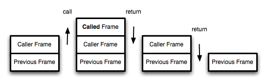

# 递归和迭代的区别

**递归容易产生栈溢出错误，这是因为递归需要保存成千上百个调用记录，通过尾递归调用优化可以解决这个问题。**

## 尾递归优化

函数调用会在内存形成一个“调用记录”，又称“调用帧”，以保存调用位置和内部变量等信息。如果在函数A的内部调用函数B，那么在A的调用记录上方，还会形成一个B的调用记录。等到B运行结束，将结果返回到A，B的调用记录才会消失。如果函数B内部还调用函数C，那就还有一个C的调用记录栈，以此类推。所有的调用记录，就形成一个"调用栈"（call stack）。



但尾调用是函数的最后一步操作，所以不需要保留外层函数的调用记录，因为调用位置、内部变量等信息都不会再用到了，只要直接用内层函数的调用记录，取代外层函数的调用记录就可以了。

```cpp
function f() {
  let m = 1;
  let n = 2;
  return g(m + n);
}
f();

// 等同于
function f() {
  return g(3);
}
f();

// 等同于
g(3);
```

如果 `g` 不是尾调用，那么函数 f 就需要保存内部变量 m 和 n 的值、g 的调用位置等信息。但由于调用 `g` 之后，函数 f 就结束了，所以执行到最后一步，完全可以删除 `f` 的调用记录，只保留内部 g(3) 的调用记录，这就叫做尾调用优化，即只保留内层函数的调用记录。如果所有函数都是尾调用，那么完全可以做到每次执行时，调用记录只有一项，这将大大节省内存。这就是"尾调用优化"的意义。
