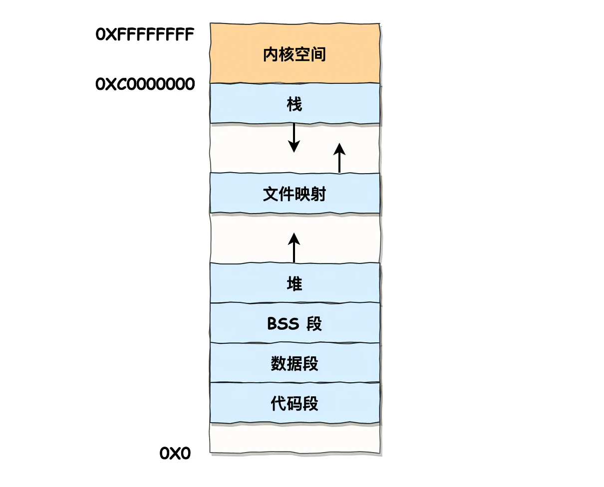
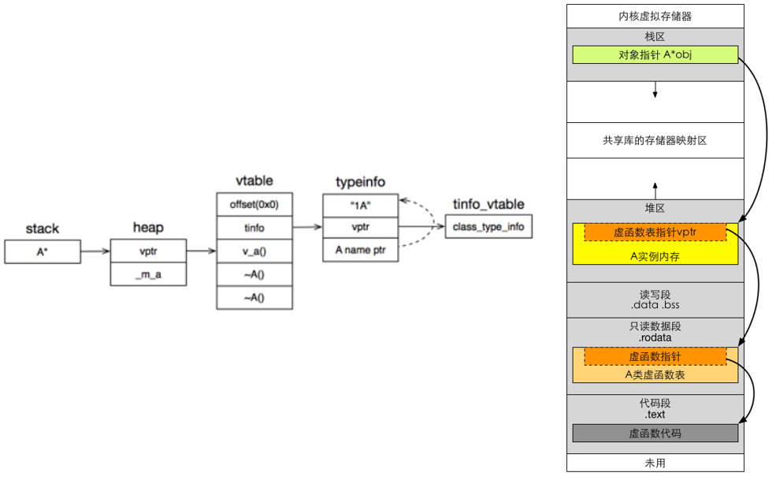

# 虚函数和虚表的原理

> 动态多态

## 内存分布



2^32 Byte= 2^22 KB = 2^12 MB  = 2^2 GB = 4GB

2^64 Byte = 2^54 KB = 2^44 MB = 2^34 GB = 2^22 TB

- 32 位系统的内核空间占用 `1GB`，位于最高处，剩下的 `3G` 是用户空间
- 64 位系统的内核空间和用户空间都是 `128TB`，分别占据整个内存空间的最高和最低处，剩下的中间部分是未定义的。

1. 进程在用户态时，只能访问用户空间内存
2. 只有进入内核态后，才可以访问内核空间的内存

用户空间内存从低到高分别是代码段、数据段、BSS段、堆段、文件映射段和栈段。

- 代码段包括二进制可执行代码
- 数据段包括已初始化的静态常量和全局变量
- BSS 段包括未初始化的静态变量和全局变量
- 堆段包括动态分配的内存，从低地址开始向上增长
- 文件映射段包括动态库、共享内存等，从低地址开始向上增长
- 栈段包括局部变量和函数调用的上下文等

使用 C 标准库的 `malloc` 或者 `mmap`，就可以分别在堆和文件映射段动态分配内存。

## 虚函数的内存分布

虚函数是通过一张虚函数表来实现的。简称 V-Table。

```cpp
class A {
  public:
    virtual void v_a() {}
    virtual ~A() {}
};

int main() {
  A* a = new A();
  return 0;
}
```

`A` 的实例 `a` 在内存中的分布如下：



- 主函数的栈帧上有一个 A 类型的指针指向堆里面分配的对象 A 实例
- 对象 A 实例的头部是一个 vptr 指针，紧接着是 A 对象按照声明顺序排列的成员变量（当我们创建一个对象时，便可以通过实例对象的地址，得到该实例的虚函数表，从而获取其函数指针）
- vptr 指针指向的是代码段的 A 类型的虚函数表中的第一个虚函数起始地址，本例中也就是 `v_a`

> <https://jacktang816.github.io/post/virtualfunction/>
