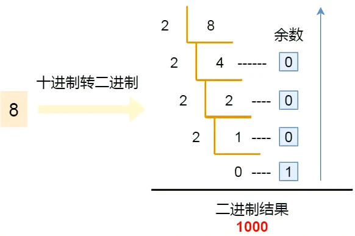
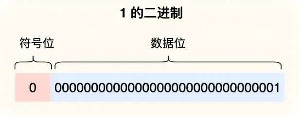
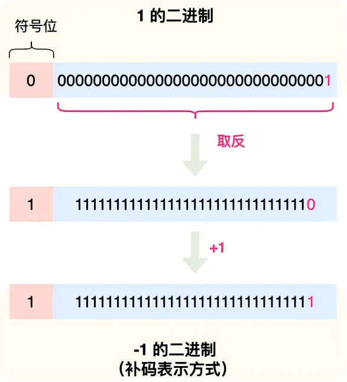
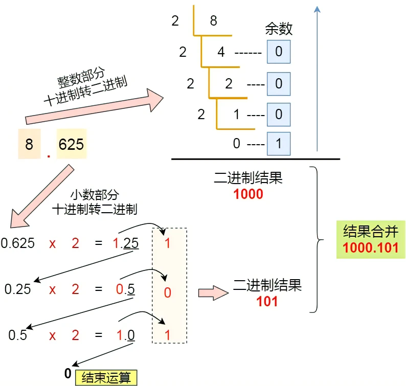
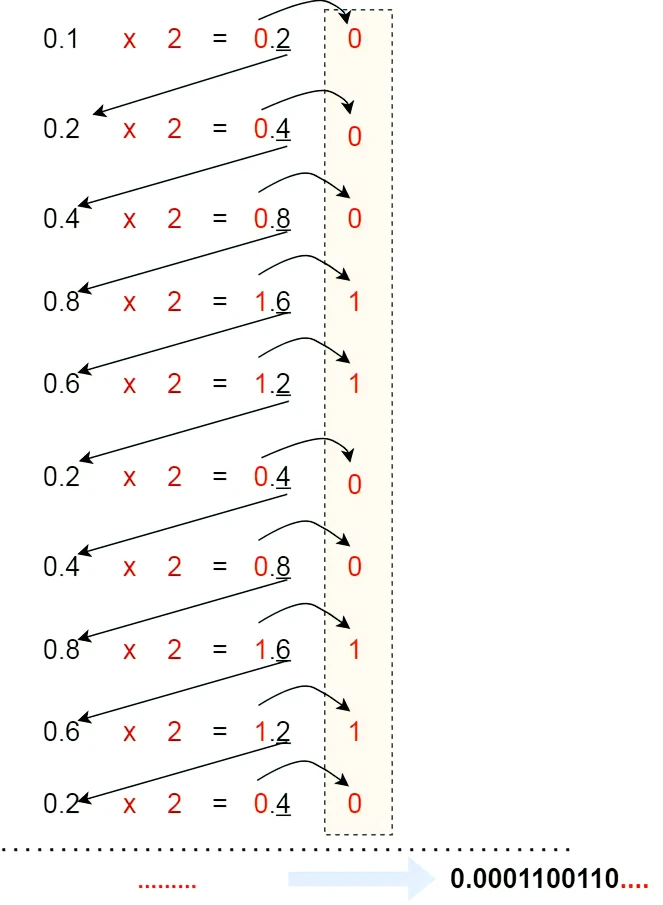
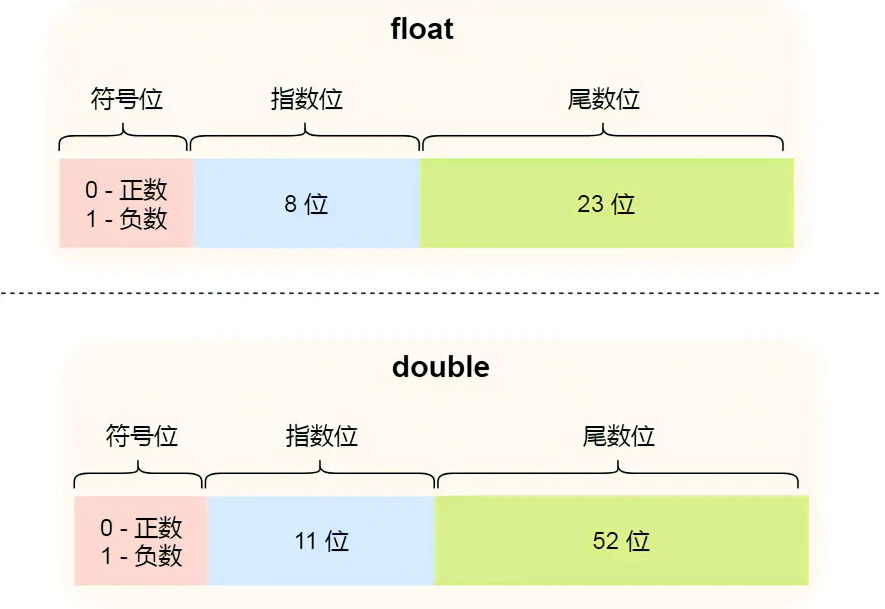
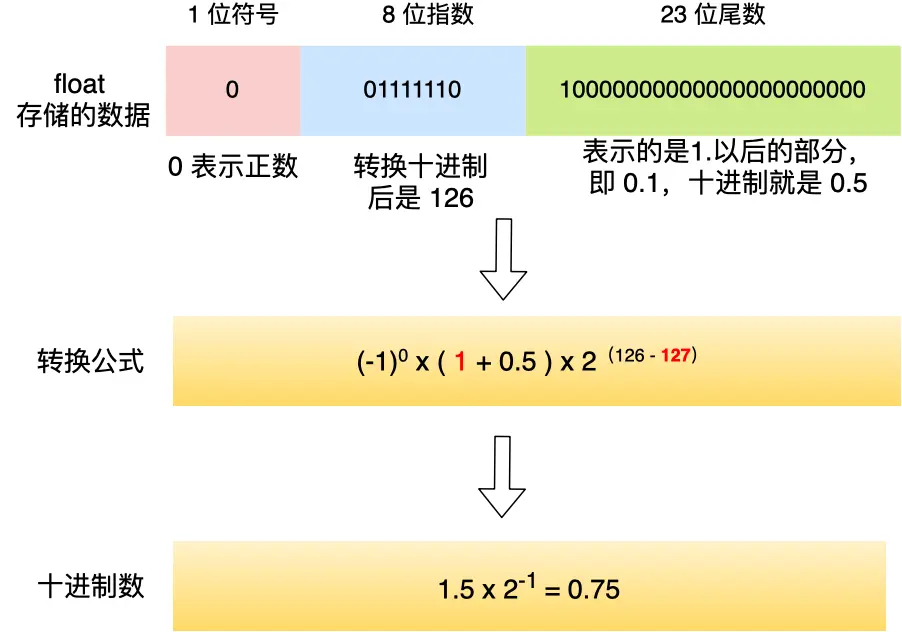
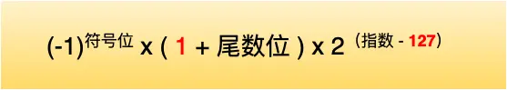

# float, double 整数部分、小数位部分个数

单精度浮点数在内存中占据 4 个字节，用 32 位二进制描述，双精度浮点数在内存中占据 8 个字节，用 64 位二进制描述。

## 负数需要使用补码表示

对于整数，十进制转换到二进制使用的是 **除 2 取余法**。

整数类型在计算机存储时，将十进制的数字转换成二进制即可。

最高位是**符号标识位**，正数的符号位是 0，负数的符号位是 1，剩余的表示具体数据。

负数使用 补码 保存，补码是把正数的二进制全部取反再加 1。

使用补码的原因是利于加减运算。

## 十进制小数与二进制的转换

对于小数，十进制转换到二进制使用的是**乘 2 取整法**，将十进制中的小数部分乘以 2 作为二进制的一位，然后继续取小数部分乘以 2 作为下一位，直到不存在小数为止。

对于 `8.625`:

最后把「整数部分 + 小数部分」结合在一起后，其结果就是 1000.101。

但是，并不是所有小数都可以用二进制表示，前面提到的 0.625 小数是一个特例，刚好通过乘 2 取整法的方式完整的转换成二进制。

如果我们用相同的方式，来把 0.1 转换成二进制，过程如下：

**由于计算机的资源是有限的，所以是没办法用二进制精确的表示 0.1，只能用「近似值」来表示，就是在有限的精度情况下，最大化接近 0.1 的二进制数，于是就会造成精度缺失的情况。**

## 计算机如何存储小数

通常将 1000.101 这种二进制数，规格化表示成 1.000101 x 2^3，其中，最为关键的是 000101 和 3 这两个东西，它就可以包含了这个二进制小数的所有信息：

- 000101 称为尾数，即小数点后的数字
- 3 称为指数，指定小数点在数据中的位置

绝大多数计算机使用的浮点数，采取 IEEE 制定的国际标准：

1. 符号位：表示数字是正数还是负数，0表示正数，1表示负数
2. 指数位：指定小数点在数据中的位置，指数可以是负数，也可以是正数，指数位的长度越长则数值的表达范围就越大
3. 尾数位：小数点右侧的数字，也就是小数部分，尾数的长度决定了这个数的精度，因此如果要表示精度更高的小数，就要提高尾数位的长度

用 32 位表示的浮点数称为单精度浮点数，用 64 位表示的浮点数称为双精度浮点数。

- double 的尾数部分是 52 位，float 的尾数部分是 23 位，由于同时都带有一个固定隐含位，所以 double 有 53 个二进制有效位，float 有 24 个二进制有效位，所以所以它们的精度在十进制中分别是 log10(2^53) 约等于 15.95 和 log10(2^24) 约等于 7.22 位，因此 double 的有效数字是 15~16 位，float 的有效数字是 7~8 位，这些有效位是包含整数部分和小数部分；

- double 的指数部分是 11 位，而 float 的指数位是 8 位，意味着 double 相比 float 能表示更大的数值范围；

**在算指数的时候，你可能会有疑问为什么要加上偏移量呢？**

前面也提到，指数可能是正数，也可能是负数，即指数是有符号的整数，而有符号整数的计算是比无符号整数麻烦的，所以为了减少不必要的麻烦，在实际存储指数的时候，需要把指数转换成无符号整数。

8.625 -> 1000.101(2) -> 1.000101 * 2^3

- 指数位：130
- 尾数位：000101+17个0
- 符号位：0

