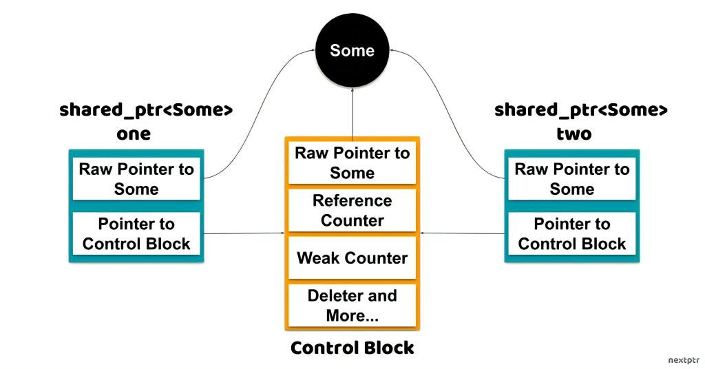

# 手写一个 shared_ptr

## 底层实现方式

`shared_ptr` 底层包含了两个指针：

1. 指针 1：指向被管理的对象
2. 指针 2：指向控制块

控制块中包括一个指针（指向被管理的对象），引用数量和弱引用数量，回收器和空间配置器。



**为什么控制块中也要包含一个同样指向被管理的对象的指针呢？**

事实上，控制块中的该指针与指针 1 可以具有不同的类型和值。如下例：

```cpp
//Another example
//Inheritance with no virtual destructor 
struct A { 
 //stuff..
 ~A() { std::cout << "~A\n"; } //not virtual
};
struct B : A { 
 //stuff..
 ~B() { std::cout << "~B\n"; } //not virtual
};

//shared_ptr<A> managing a B object
//raw pointer is A* and managed pointer is B*
auto pa = std::shared_ptr<A>(new B()); //OK

pa.reset(); //Calls B's destructor
```

这时，仍然会调用 B 的析构函数。因为，shared_ptr 在析构时是使用的 control block 中的指针，而不是指针 1。

再看一个 shared_ptr 别名构造函数的例子：

```cpp
auto ep = std::shared_ptr<Egg>(new Egg());

// Aliasing constructor to construct shared_ptr<Yolk>
// yp shares ownership with ep but points to subobject ep->y
auto yp = std::shared_ptr<Yolk>(ep, &ep->y);

std::cout << ep.use_count();
```

这里，ep 的指针 1 指向的是 Egg，yp 的指针 1 指向的是 Yolk，但 ep 和 yp 的 control block 中的指针指向的都是 Egg，这样，析构时才能正确的回收内存。

**你应该使用 make_shared:**

make_shared 效率更高，统一了被管理对象和 control block 对象初始化的过程，只需要一次内存分配即可，相比于单独初始化被管理对象和 control block 对象，显然执行效率更高了！

**引用计数规则：**

引用数量的递增和递减是原子性的。

**弱引用数量：**

弱引用数量与所管理对象的生命周期并无关联，但是只有弱引用数量和引用数量均为 0 的时候，control block 才会被删除。

## 一个简单的实现

```cpp
#pragma once
#include <cstddef>
#include <iostream>
#include <memory>
#include <mutex>
#include <sys/types.h>
#include <thread>

template <typename T> class SharedPtr {
private:
  T *ptr;
  uint *ref_count; // shared between different `SharedPtr` objects, so it must
                   // be a pointer.

public:
  SharedPtr(T *ptr) : ptr(ptr), ref_count(new uint(1)) {}

  // Copy constructor
  SharedPtr(const SharedPtr &obj) {
    std::cout << "COPY CONSTRUCTOR" << '\n';
    ptr = obj.ptr;
    ref_count = obj.ref_count;
    if (obj.ptr) {
      // if the pointer isn't null, increment the ref count
      (*ref_count)++;
    }
  }

  // Assignment operator
  SharedPtr &operator=(const SharedPtr &obj) {
    std::cout << "COPY ASSIGNMENT" << '\n';
    if (this == &obj) // 如果是自己，那么不做什么
      return *this;
    if (obj.ptr) {
      // if the pointer isn't null, increment the ref count
      (*obj.ref_count)++;
    }

    if (--(*ref_count) == 0) {
      std::cout << "DELETE IN COPY ASSIGNMENT" << '\n';
      delete ptr;
      delete ref_count;
    }

    ptr = obj.ptr;
    ref_count = obj.ref_count;
    return *this;
  }

  // Move constructor
  SharedPtr(SharedPtr &&obj) {
    std::cout << "MOVE CONSTRUCTOR" << '\n';
    ptr = obj.ptr;
    ref_count = obj.ref_count;

    obj.ptr = nullptr;
    obj.ref_count = nullptr;
  }

  // Move assignment
  SharedPtr &operator=(SharedPtr &&obj) {
    std::cout << "MOVE ASSIGNMENT" << '\n';
    if (this == &obj)
      return *this;

    if (--(*ref_count) == 0) {
      std::cout << "DELETE IN MOVE ASSIGNMENT" << '\n';
      delete ptr;
      delete ref_count;
    }

    ptr = obj.ptr;
    ref_count = obj.ref_count;

    obj.ptr = nullptr;
    obj.ref_count = nullptr;
    return *this;
  }

  T *operator->() const { return ptr; }

  T &operator*() const { return *ptr; }

  uint GetCount() const { return *(ref_count); }

  T *Get() const { return ptr; }

  ~SharedPtr() {
    if (ptr && --*ref_count == 0) {
      std::cout << "DELETE IT" << '\n';
      delete ptr;
      delete ref_count;
    }
  }
};
```
