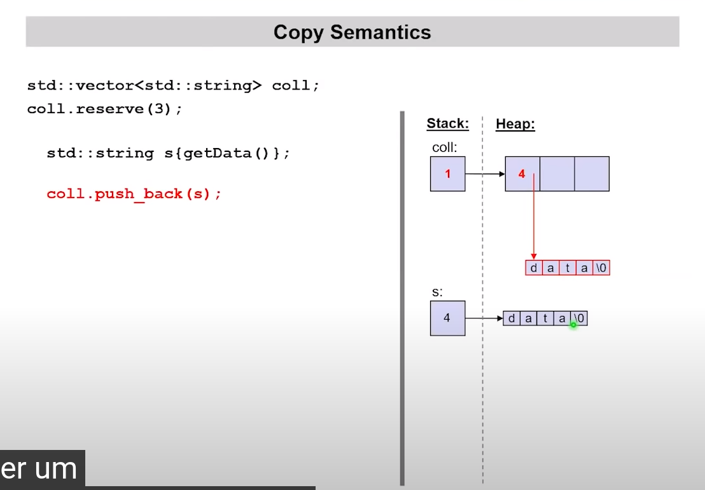
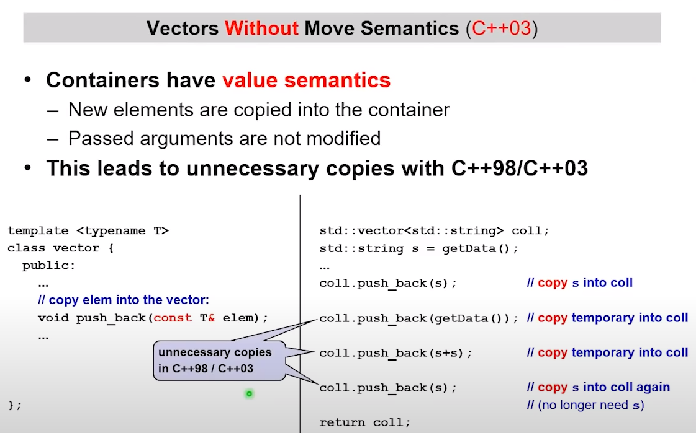
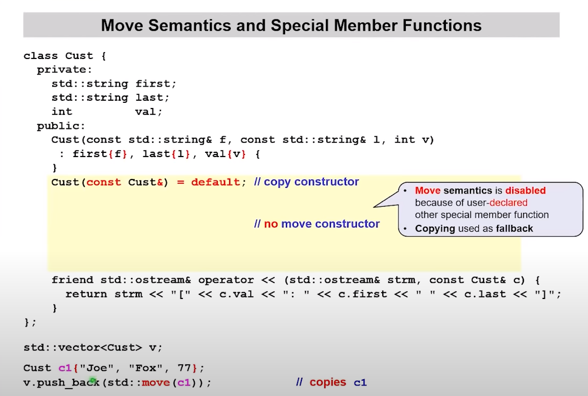
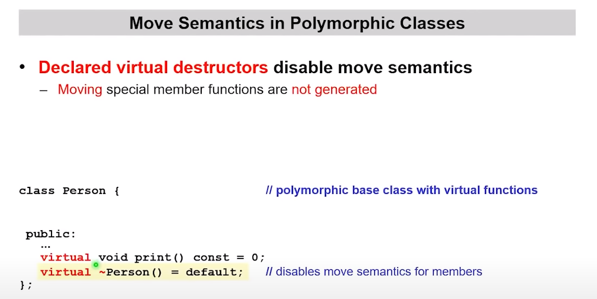
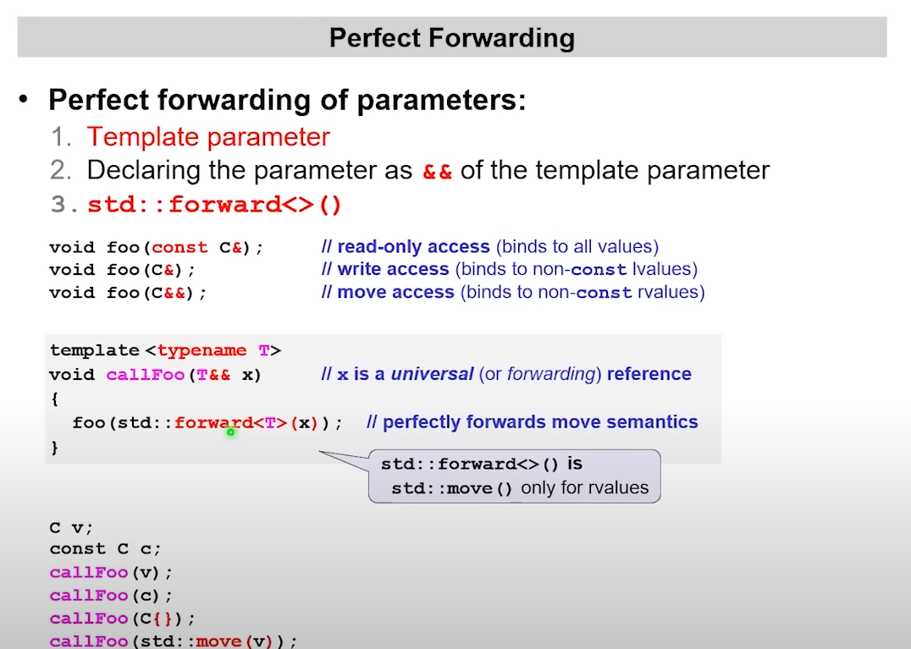
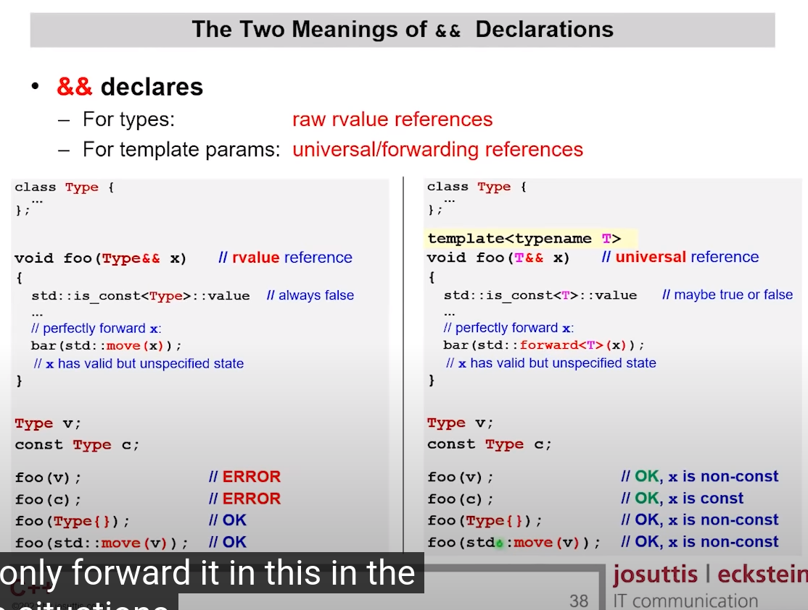

# Move 语义

默认情况下，`push_back` 使用 copy 构造器。

所以这时我们应该使用 `push_back(std::move(s))`

对于 `push_back(getData())`，由于 getData 返回的是一个临时变量，也就是右值，所以这里不会拷贝。

`std::move` says I no longer need this value here. It's just a mark!

