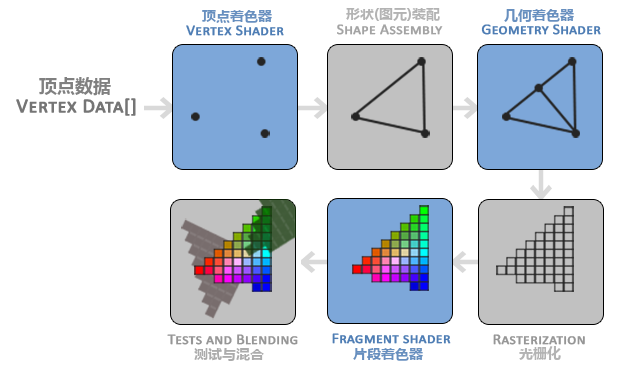

# OpenGL 渲染管线

## OpenGL 是什么

OpenGL 是由 Khronos 组织制定并维护的规范。

## 渲染管线

在 OpenGL 中，任何事物都在 3D 空间中，但屏幕和窗口却是 2D 像素数组，由 3D 坐标转为 2D 坐标的处理过程是由 OpenGL 的图形渲染管线完成的。

### 顶点着色器

用于把 3D 坐标转化为另一种 3D 坐标

### 图元装配

将顶点着色器输出的所有顶点作为输入，装配成指定图元的形状

### 几何着色器

几何着色器把图元形式的一系列顶点的集合作为输入，它可以通过产生新顶点构造出新的图元来生成其他形状

### 光栅化

这里它会把图元映射为最终屏幕上相应的像素，生成供片段着色器(Fragment Shader)使用的片段(Fragment)。在片段着色器运行之前会执行裁切(Clipping)。裁切会丢弃超出你的视图以外的所有像素，用来提升执行效率。

### 片段着色器

计算一个像素的最终颜色，这也是所有OpenGL高级效果产生的地方。通常，片段着色器包含3D场景的数据（比如光照、阴影、光的颜色等等），这些数据可以被用来计算最终像素的颜色。

### Alpha测试和混合

在所有对应颜色值确定以后，最终的对象将会被传到最后一个阶段，我们叫做Alpha测试和混合(Blending)阶段。这个阶段检测片段的对应的深度（和模板(Stencil)）值（后面会讲），用它们来判断这个像素是其它物体的前面还是后面，决定是否应该丢弃。这个阶段也会检查alpha值（alpha值定义了一个物体的透明度）并对物体进行混合(Blend)。所以，即使在片段着色器中计算出来了一个像素输出的颜色，在渲染多个三角形的时候最后的像素颜色也可能完全不同。
