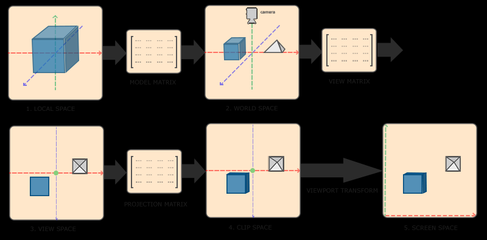

# 坐标系统

OpenGL 希望在每次顶点着色器运行后，可见的所有顶点都为标准化设备坐标。

## 局部空间

以局部原点为参考的坐标，也是物体起始的坐标。

## 世界空间

局部空间坐标经过 Model Matrix，转化为世界空间坐标，世界空间坐标是处于一个更大的空间范围的。这些坐标相对于世界的全局原点，它们会和其它物体一起相对于世界的原点进行摆放。

## 观察空间

世界空间坐标经过 View Matrix，转变为观察空间坐标，这个坐标是相对于摄像机或者说观察者的。

## 裁剪空间

观察空间坐标经过 Projection Matrix，会被投影到裁剪空间，获得裁剪空间坐标，裁剪空间坐标会被处理到 -1 到 1的范围内。

## 屏幕空间

裁剪空间坐标经过视口变换，转化为屏幕坐标。
