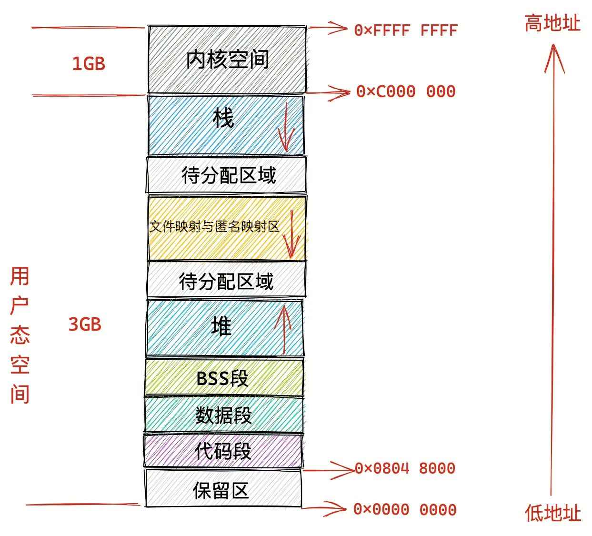

# 深入理解 Linux 虚拟内存管理

## 什么是虚拟内存地址

虚拟地址是人为设计的一个概念，物理地址则是数据在物理内存中的真实存储位置。

以 Intel Core i7 处理器为例，64 位虚拟地址的格式为：全局页目录项（9 位）+ 上层页目录项（9 位）+ 中间页目录项（9 位）+ 页表项（9 位）+ 页内偏移（12 位）。共 48 位组成的虚拟内存地址。

## Linux 虚拟内存空间分布

