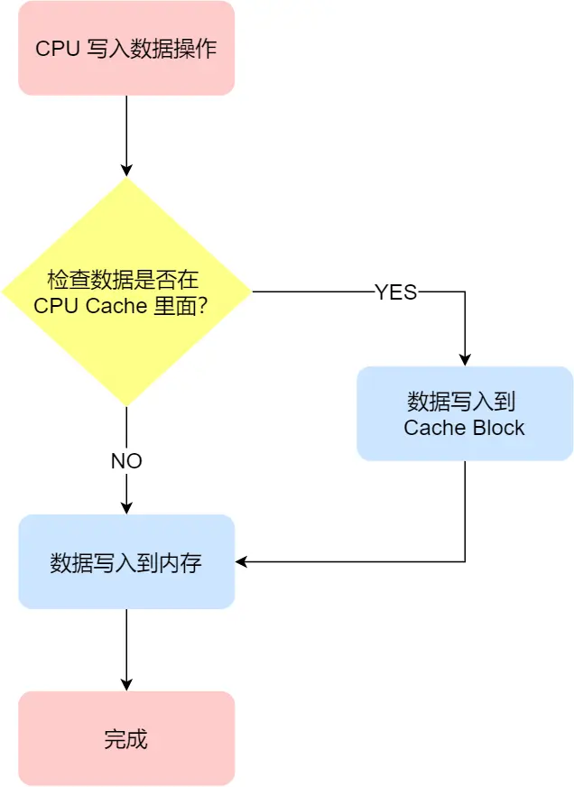
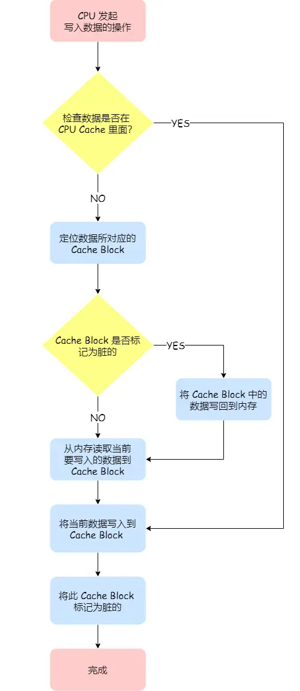

# CPU 缓存一致性

数据写入 CPU 的缓存之后，内存与缓存数据将会不同，问题即是什么时候将缓存中的数据写回到内存中。

## 写直达

把数据同时写入内存和缓存之中，即为写直达。

1. 如果数据已经在缓存中，先将数据更新到缓存之中，然后写入到内存
2. 如果数据没有在缓存中，直接把数据更新到内存

缺点：每次写操作都会写回到内存，性能有问题

## 写回

发生写操作时，新的数据仅被写入到缓存中，只有当修改过的缓存被替换时才需要写入到内存中。

1. 发生写操作时，如果数据已经在缓存中，那么更新数据之后，标记缓存中的这个块为脏数据（即缓存块中的数据与内存不一致），但此时不需要把数据写到内存
2. 发生写操作时，如果数据没有在缓存中，需要检查数据将要写入的缓存块
   1. 若缓存块中的数据为脏数据，则将这个缓存块中的数据写回到内存，然后把当前要写入的数据，先从内存读入到缓存块中（Assume you have 64-byte cache lines, and you write one byte. You can't put "1/64ths of a cache line" into the cache, so where do the remaining 63 bytes come from? They have to come from main memory (or the next level cache).），然后把当前要写入的数据写入到缓存块，标记为脏数据
   2. 若缓存块中的数据不为脏数据，把当前要写入的数据，先从内存读入到缓存块中，然后把当前要写入的数据写入到缓存块，标记为脏数据

可以发现写回这个方法，在把数据写入到 Cache 的时候，只有在缓存不命中，同时数据对应的 Cache 中的 Cache Block 为脏标记的情况下，才会将数据写到内存中，而在缓存命中的情况下，则在写入后 Cache 后，只需把该数据对应的 Cache Block 标记为脏即可，而不用写到内存里。

这样的好处是，如果我们大量的操作都能够命中缓存，那么大部分时间里 CPU 都不需要读写内存，自然性能相比写直达会高很多。

为什么缓存没命中时，还要定位 Cache Block？这是因为此时是要判断数据即将写入到 Cache Block 里的位置，是否被「其他数据」占用了此位置，如果这个「其他数据」是脏数据，那么就要帮忙把它写回到内存。

## 多核心缓存一致性问题

### 写传播

某个 CPU 核心中的缓存数据更新时，必须要传播到其他核心的缓存中，这个称为写传播

### 事务的串行化

需要保证不同的核心能看到相同顺序的数据变化。

1. CPU 核心对于缓存中的操作，需要同步给其他核心
2. 需要引入 锁，如果两个核心里有相同数据的缓存，那么对于这个缓存数据的更新，只有拿到了锁，才能进行更新

### 实现

基于总线嗅探可以实现写传播，但无法实现事务串行化。

### MESI 协议

MESI 协议基于总线嗅探机制实现了事务的串行化，也用状态机机制降低了总线压力，从而实现了缓存一致性。

#### 四个状态

- Modified, 已修改
- Exclusive, 独占
- Shared, 共享
- Invalid, 失效

这四个状态来标记 Cache Line 四个不同的状态。

「已修改」状态就是我们前面提到的脏标记，代表该 Cache Block 上的数据已经被更新过，但是还没有写到内存里。而「已失效」状态，表示的是这个 Cache Block 里的数据已经失效了，不可以读取该状态的数据。

「独占」和「共享」状态都代表 Cache Block 里的数据是干净的，也就是说，这个时候 Cache Block 里的数据和内存里面的数据是一致性的。

「独占」和「共享」的差别在于，独占状态的时候，数据只存储在一个 CPU 核心的 Cache 里，而其他 CPU 核心的 Cache 没有该数据。这个时候，如果要向独占的 Cache 写数据，就可以直接自由地写入，而不需要通知其他 CPU 核心，因为只有你这有这个数据，就不存在缓存一致性的问题了，于是就可以随便操作该数据。

另外，在「独占」状态下的数据，如果有其他核心从内存读取了相同的数据到各自的 Cache ，那么这个时候，独占状态下的数据就会变成共享状态。

那么，「共享」状态代表着相同的数据在多个 CPU 核心的 Cache 里都有，所以当我们要更新 Cache 里面的数据的时候，不能直接修改，而是要先向所有的其他 CPU 核心广播一个请求，要求先把其他核心的 Cache 中对应的 Cache Line 标记为「无效」状态，然后再更新当前 Cache 里面的数据。

我们举个具体的例子来看看这四个状态的转换：

1. 当 A 号 CPU 核心从内存读取变量 i 的值，数据被缓存在 A 号 CPU 核心自己的 Cache 里面，此时其他 CPU 核心的 Cache 没有缓存该数据，于是标记 Cache Line 状态为「独占」，此时其 Cache 中的数据与内存是一致的；
2. 然后 B 号 CPU 核心也从内存读取了变量 i 的值，此时会发送消息给其他 CPU 核心，由于 A 号 CPU 核心已经缓存了该数据，所以会把数据返回给 B 号 CPU 核心。在这个时候， A 和 B 核心缓存了相同的数据，Cache Line 的状态就会变成「共享」，并且其 Cache 中的数据与内存也是一致的；
3. 当 A 号 CPU 核心要修改 Cache 中 i 变量的值，发现数据对应的 Cache Line 的状态是共享状态，则要向所有的其他 CPU 核心广播一个请求，要求先把其他核心的 Cache 中对应的 Cache Line 标记为「无效」状态，然后 A 号 CPU 核心才更新 Cache 里面的数据，同时标记 Cache Line 为「已修改」状态，此时 Cache 中的数据就与内存不一致了。
4. 如果 A 号 CPU 核心「继续」修改 Cache 中 i 变量的值，由于此时的 Cache Line 是「已修改」状态，因此不需要给其他 CPU 核心发送消息，直接更新数据即可。
5. 如果 A 号 CPU 核心的 Cache 里的 i 变量对应的 Cache Line 要被「替换」，发现 Cache Line 状态是「已修改」状态，就会在替换前先把数据同步到内存。

所以，可以发现当 Cache Line 状态是「已修改」或者「独占」状态时，修改更新其数据不需要发送广播给其他 CPU 核心，这在一定程度上减少了总线带宽压力。

> reference: <https://xiaolincoding.com/os/1_hardware/cpu_mesi.html#mesi-%E5%8D%8F%E8%AE%AE>
