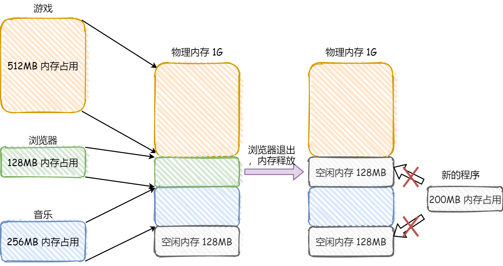
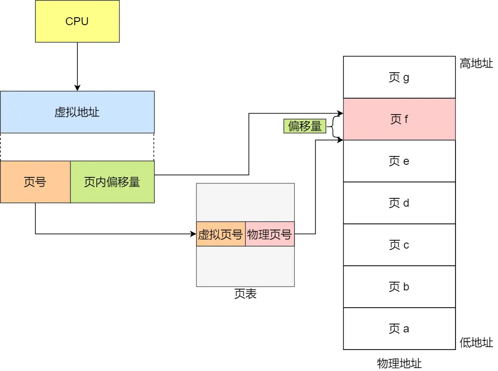
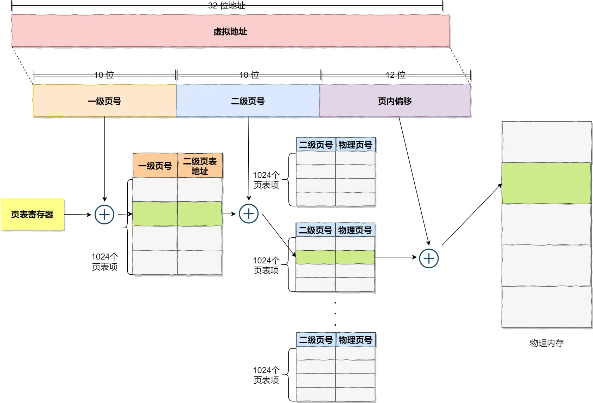

# 为什么要有虚拟内存

> 原文：<https://xiaolincoding.com/os/3_memory/vmem.html#%E5%86%85%E5%AD%98%E5%88%86%E6%AE%B5>

为了管理多个进程，操作系统将进程所使用的地址**隔离**开来，即让操作系统为每个进程分配一套虚拟地址。而操作系统负责将不同进程的虚拟地址和不同内存的物理地址映射起来。如果程序要访问虚拟地址的时候，由操作系统转换成不同的物理地址，这样不同的进程运行的时候，写入的是不同的物理地址，这样就不会冲突了。

于是，这里就引出了两种地址的概念：

1. 我们程序所使用的内存地址叫做虚拟内存地址（Virtual Memory Address）
2. 实际存在硬件里面的空间地址叫物理内存地址（Physical Memory Address）。

## 操作系统如何管理虚拟地址与物理地址之间的关系

主要包括内存分段和内存分页两种方式。

## 内存分段

程序是由若干个逻辑分段组成的，如可由代码分段、数据分段、栈段、堆段组成。不同的段是有不同的属性的，所以就用分段（Segmentation）的形式把这些段分离出来。

内存分段可能会产生内存碎片的问题。

假设有 1G 的物理内存，用户执行了多个程序，其中：

游戏占用了 512MB 内存
浏览器占用了 128MB 内存
音乐占用了 256 MB 内存。
这个时候，如果我们关闭了浏览器，则空闲内存还有 1024 - 512 - 256 = 256MB。

如果这个 256MB 不是连续的，被分成了两段 128 MB 内存，这就会导致没有空间再打开一个 200MB 的程序。

### 内存分段会出现内存碎片吗？

内存碎片主要分为，内部内存碎片和外部内存碎片。

内存分段管理可以做到段根据实际需求分配内存，所以有多少需求就分配多大的段，所以不会出现内部内存碎片。

但是由于每个段的长度不固定，所以多个段未必能恰好使用所有的内存空间，会产生了多个不连续的小物理内存，导致新的程序无法被装载，所以会出现外部内存碎片的问题。

**解决「外部内存碎片」的问题就是内存交换。**

可以把音乐程序占用的那 256MB 内存写到硬盘上，然后再从硬盘上读回来到内存里。不过再读回的时候，我们不能装载回原来的位置，而是紧紧跟着那已经被占用了的 512MB 内存后面。这样就能空缺出连续的 256MB 空间，于是新的 200MB 程序就可以装载进来。

这个内存交换空间，在 Linux 系统里，也就是我们常看到的 Swap 空间，这块空间是从硬盘划分出来的，用于内存与硬盘的空间交换。

### 内存分段为什么会导致内存交换效率低？

对于多进程的系统来说，应用内存分段的策略下，外部内存碎片是很容易产生的，产生了外部内存碎片，就不得不重新 swap 内存区域，这个过程会产生性能瓶颈。

因为硬盘的访问速度要比内存慢太多了，每一次内存交换，都需要把一大段连续的内存数据写到硬盘上。所以，如果内存交换的时候，交换的是一个占内存很大的程序，这样整个机器都会卡顿。

正因如此，就出现了内存分页。

## 内存分页

分段的好处是能产生连续的内存空间，但是会出现「外部内存碎片和内存交换的空间太大」的问题。

为解决该问题：

1. 尽量减少内存碎片
2. 需要进行内存交换的时候，与磁盘交换的数据要小一些

这个方法就是内存分页（Paging）。

分页是把整个虚拟和物理内存空间切成一段段固定尺寸的大小，这样一个连续并且尺寸固定的内存空间，我们叫做页（Page）。在 Linux 下，每一页的大小为 4kb。

### 分页是怎么解决分段的「外部内存碎片和内存交换效率低」的问题？

内存分页由于内存空间都是预先划分好的，也就不会像内存分段一样，在段与段之间会产生间隙非常小的内存，这正是分段会产生外部内存碎片的原因。而采用了分页，页与页之间是紧密排列的，所以不会有外部碎片。

但是，因为内存分页机制分配内存的最小单位是一页，即使程序不足一页大小，我们最少只能分配一个页，所以页内会出现内存浪费，所以针对内存分页机制会有内部内存碎片的现象。

如果内存空间不够，操作系统会把其他正在运行的进程中的「最近没被使用」的内存页面给释放掉，也就是暂时写在硬盘上，称为换出（Swap Out）。一旦需要的时候，再加载进来，称为换入（Swap In）。所以，一次性写入磁盘的也只有少数的一个页或者几个页，不会花太多时间，内存交换的效率就相对比较高。

### 多级页表

利用了计算机中无所不在的局部性原理。

#### TLB

多级页表虽然解决了空间上的问题，但是虚拟地址到物理地址的转换效率就低了。计算机科学家们就在 CPU 芯片中，加入了一个专门存放程序最常访问的页面项的 Cache，这个 Cache 就是 TLB（Translation Lookaside Buffer, 页表缓存）

## 段页式内存管理

内存分段和内存分页并不是对立的，它们是可以组合起来在同一个系统中使用的。

- 先将程序划分为多个有逻辑意义的段
- 接着再把每个段划分为多个页，也就是对分段划分出来的连续空间，再划分为固定大小的页

段页式地址变换中要得到物理地址须经过三次内存访问：

- 第一次访问段表，得到页表起始地址；
- 第二次访问页表，得到物理页号；
- 第三次将物理页号与页内位移组合，得到物理地址。

可用软、硬件相结合的方法实现段页式地址变换，这样虽然增加了硬件成本和系统开销，但提高了内存的利用率。

## Linux 系统中的内存布局

Linux 系统中的每个段都是从 0 地址开始的整个 4GB 虚拟空间（32 位环境下），也就是所有的段的起始地址都是一样的。这意味着，Linux 系统中的代码，包括操作系统本身的代码和应用程序代码，所面对的地址空间都是线性地址空间（虚拟地址），这种做法相当于屏蔽了处理器中的逻辑地址概念，段只被用于访问控制和内存保护。

相当于只存在一个内存分段，实际使用时，会根据页表映射到相应的物理内存。

## 虚拟内存有什么作用？

1. 第一，虚拟内存可以使得进程对运行内存超过物理内存大小，因为程序运行符合局部性原理，CPU 访问内存会有很明显的重复访问的倾向性，对于那些没有被经常使用到的内存，我们可以把它换出到物理内存之外，比如硬盘上的 swap 区域。
2. 第二，由于每个进程都有自己的页表，所以每个进程的虚拟内存空间就是相互独立的。进程也没有办法访问其他进程的页表，所以这些页表是私有的，这就解决了多进程之间地址冲突的问题。
3. 第三，页表里的页表项中除了物理地址之外，还有一些标记属性的比特，比如控制一个页的读写权限，标记该页是否存在等。在内存访问方面，操作系统提供了更好的安全性。
