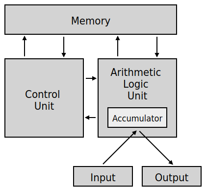
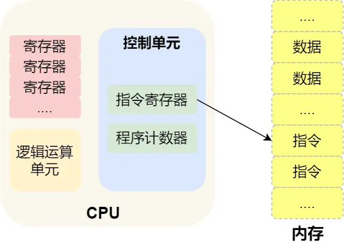

# CPU 是如何执行程序的

冯诺依曼和其他计算机科学家遵循图灵机的设计，提出了冯诺依曼模型。

五个部分：运算器、控制器、存储器、输入设备、输出设备。

## 中央处理器

CPU 内部包括寄存器、控制单元和逻辑运算单元。

常见的寄存器种类：

1. 通用寄存器，用来存放需要计算的数据
2. 程序计数器，用来存储 CPU 要执行下一条指令所在的内存地址
3. 指令寄存器，用来存放当前正在执行的指令，也就是指令本身，指令被执行完成之前，都存储在这里

## 程序执行的基本过程

1. 高级代码编译成汇编代码
2. CPU 载入代码到内存中
3. 逐步执行

