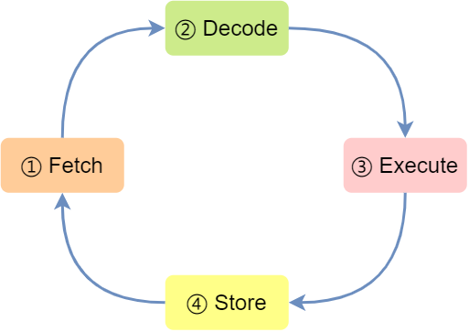

# CPU 是如何执行程序的

冯诺依曼和其他计算机科学家遵循图灵机的设计，提出了冯诺依曼模型。

五个部分：运算器、控制器、存储器、输入设备、输出设备。


其中运算器和控制器一般在中央处理器中，存储器即为常见的内存，输入输出设备即为计算机外接的设备。存储单元和输入输出设备通过总线与中央处理器交互。

## 内存

基本单位是字节（byte），1 字节等于 8 bit，每一个字节对应一个内存地址。

## 中央处理器

32 位处理器，一次可以处理 4 个字节，64 位处理器，一次可以处理 8 个字节。

CPU 内部包括寄存器、控制单元和逻辑运算单元。

常见的寄存器种类：

1. 通用寄存器，用来存放需要计算的数据
2. 程序计数器，用来存储 CPU 要执行下一条指令所在的内存地址
3. 指令寄存器，用来存放当前正在执行的指令，也就是指令本身，指令被执行完成之前，都存储在这里

## 总线

1. 地址总线，用于指定 CPU 将要操作的内存地址
2. 数据总线，用于读写内存的数据
3. 控制总线，用于发送和接收信号，比如中断、设备复位等信号，CPU 收到信号后响应也需要控制总线

## 程序执行的基本过程


那 CPU 执行程序的过程如下：

- 第一步，CPU 读取「程序计数器」的值，这个值是指令的内存地址，然后 CPU 的「控制单元」操作「地址总线」指定需要访问的内存地址，接着通知内存设备准备数据，数据准备好后通过「数据总线」将指令数据传给 CPU，CPU 收到内存传来的数据后，将这个指令数据存入到「指令寄存器」。
- 第二步，「程序计数器」的值自增，表示指向下一条指令。这个自增的大小，由 CPU 的位宽决定，比如 32 位的 CPU，指令是 4 个字节，需要 4 个内存地址存放，因此「程序计数器」的值会自增 4；
- 第三步，CPU 分析「指令寄存器」中的指令，确定指令的类型和参数，如果是计算类型的指令，就把指令交给「逻辑运算单元」运算；如果是存储类型的指令，则交由「控制单元」执行；

CPU 从程序计数器读取指令，到执行，再到下一条指令，这个过程不断循环，直到程序执行结束，这个不断循环的过程被称为 CPU 的指令周期。

## a=1+2的执行过程

1. 高级代码编译成汇编代码
2. 汇编代码编译为机器码
3. CPU 载入代码到内存中
4. 逐步执行

编译器会把 `a=1+2` 翻译为四条指令，存放到代码段中

```asm
load 0x200 R0
load 0x204 R1
add R0 R1 R2
set R2 0x208
```

一条指令的执行通常分为 4 个阶段，称为 4 级流水线：



1. CPU 通过程序计数器读取对应内存地址的指令，这个部分称为 Fetch（取得指令）
2. CPU 对指令进行解码，这个部分称为 Decode（指令译码）
3. CPU 执行指令，这个部分称为 Execution（执行指令）
4. CPU 将计算结果回写到寄存器，或者将寄存器的值存入内存，这个部分称为 Store（数据回写）
