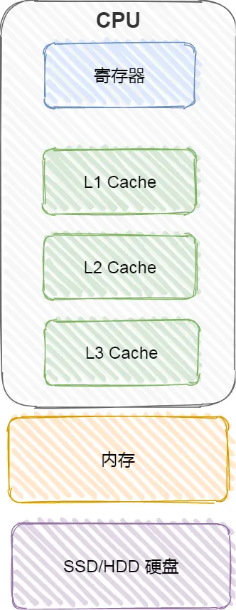
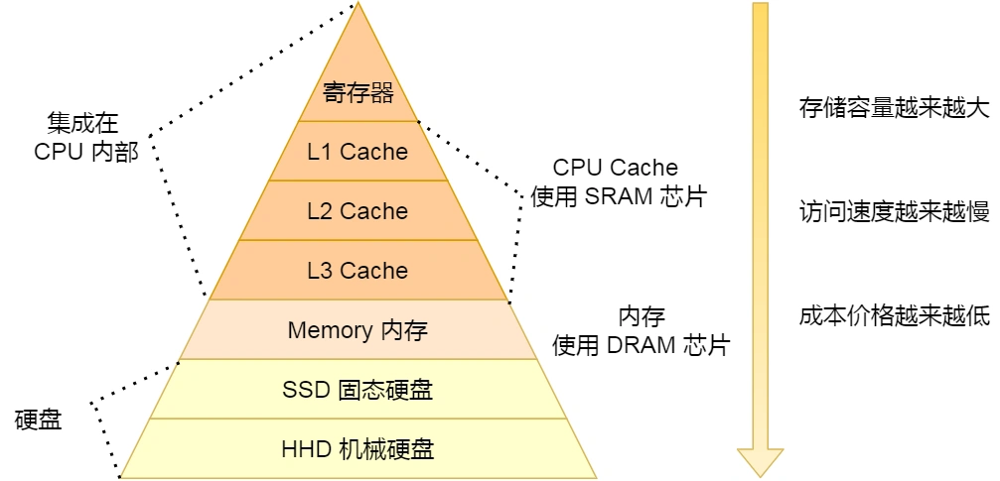

# 磁盘与硬盘慢几万倍

CPU 缓存使用的是一种叫 SRAM（Static Random-Access Memory, 静态随机存储器）的芯片。包括 L1, L2, L3 三级缓存。

内存使用的是一种叫 DRAM（Dynamic Random-Access Memory, 动态随机存取存储器）的芯片。

SSD（Solid-state disk）就是我们常说的固体硬盘，结构和内存类似。结构和内存类似，但是它相比内存的优点是断电后数据仍然存在，而内存、寄存器、高速缓存断电中数据都会丢失。

HDD（Hard Disk Drive），通过物理读写的方式来访问数据。

L3 Cache 比 L1 Cache 和 L2 Cache 大很多，这是因为 L1 Cache 和 L2 Cache 都是每个 CPU 核心独有的，而 L3 Cache 是多个 CPU 核心共享的。
