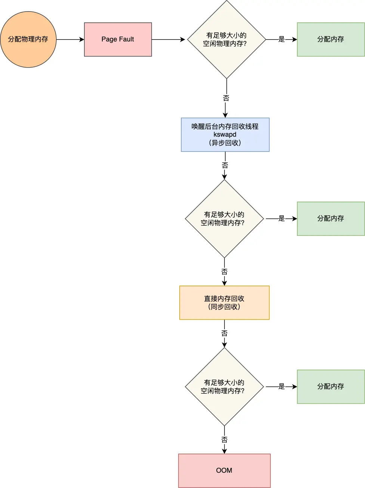

# 内存满了，会发生什么

当发现虚拟内存还没有映射到物理内存，CPU 就会产生缺页中断。进程就会从用户态切换到内核态，并将缺页中断交给内核的 Page Fault Handler 处理。

Page Fault Handler Function:

1. 如果有空闲的物理内存，直接分配，并建立虚拟内存与物理内存之间的映射关系
2. 否则，回收内存：
   1. 后台内存回收：kswapd，异步，不会阻塞进程的执行
   2. 直接内存回收：direct reclaim，同步，阻塞进程的执行
3. 否则，OOM 机制，OOM Killer 机制会根据算法选择一个占用物理内存较高的进程，然后将其杀死，以便释放内存资源，如果物理内存依然不足，OOM Killer 会继续杀死占用物理内存较高的进程，直到释放足够的内存位置。

## 哪些内存可以被回收

系统内存紧张的时候，就会进行回收内存的工作，那具体哪些内存是可以被回收的呢？

主要有两类内存可以被回收，而且它们的回收方式也不同。

- 文件页（File-backed Page）：内核缓存的磁盘数据（Buffer）和内核缓存的文件数据（Cache）都叫作文件页。大部分文件页，都可以直接释放内存，以后有需要时，再从磁盘重新读取就可以了。而那些被应用程序修改过，并且暂时还没写入磁盘的数据（也就是脏页），就得先写入磁盘，然后才能进行内存释放。所以，回收干净页的方式是直接释放内存，回收脏页的方式是先写回磁盘后再释放内存。
- 匿名页（Anonymous Page）：这部分内存没有实际载体，不像文件缓存有硬盘文件这样一个载体，比如堆、栈数据等。这部分内存很可能还要再次被访问，所以不能直接释放内存，它们回收的方式是通过 Linux 的 Swap 机制，Swap 会把不常访问的内存先写到磁盘中，然后释放这些内存，给其他更需要的进程使用。再次访问这些内存时，重新从磁盘读入内存就可以了。

文件页和匿名页的回收都是基于 LRU 算法，也就是优先回收不常访问的内存。
