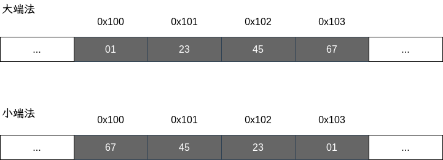

# 信息的表示和处理

16 进制出现的目的是为了更好的与 2 进制之间转换。

如：FF(16 进制) 可以表示为 11111111(2 进制).

- 10 进制转 2 进制：除 2 取余
- 10 进制转 16 进制：除 16 取余

## 字长（word size）

每台计算机都有一个字长，表示整数和指针数据的标称大小（nominal size），虚拟地址是以这样一个字长进行编码的，所以字长决定了虚拟地址空间的大小，对于 32 位系统，最大寻址空间为 4GB。

## 小端法 vs 大端法

> ... 某些机器选择在存储器中按照从最低有效字节到最高有效字节的顺序存储对象，而另一些机器则按照从最高有效字节到最低有效字节的顺序存储。前一种称为小端法，后一种称为大端法。...

在十六进制 `0x01234567` 中，`0x01` 为最高有效字节，`0x67` 为最低有效字节。

## IEEE 浮点数表示

IEEE 浮点标准使用 $V=(-1)^s * M * 2^E$ 表示一个数。

