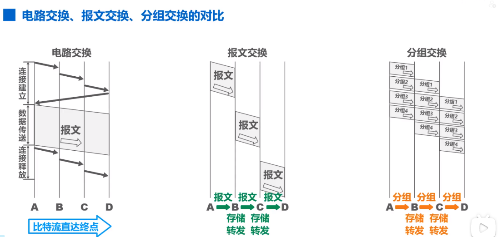
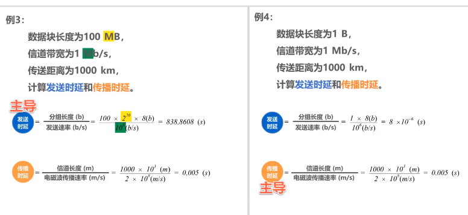
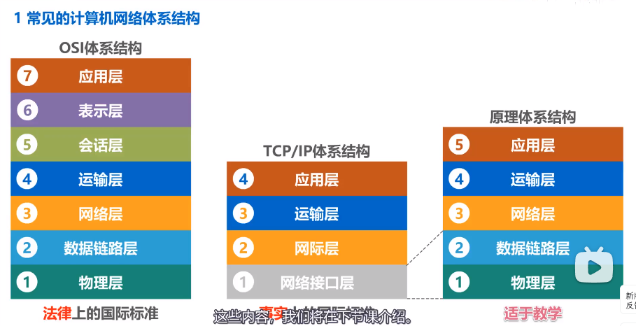
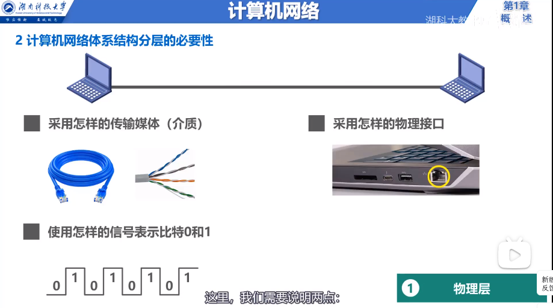
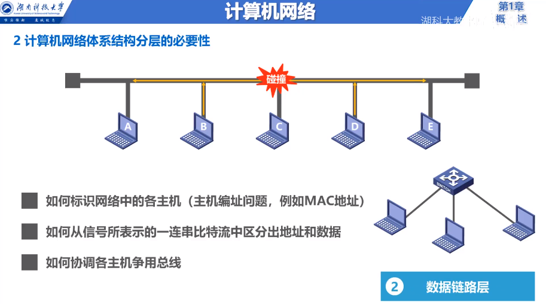
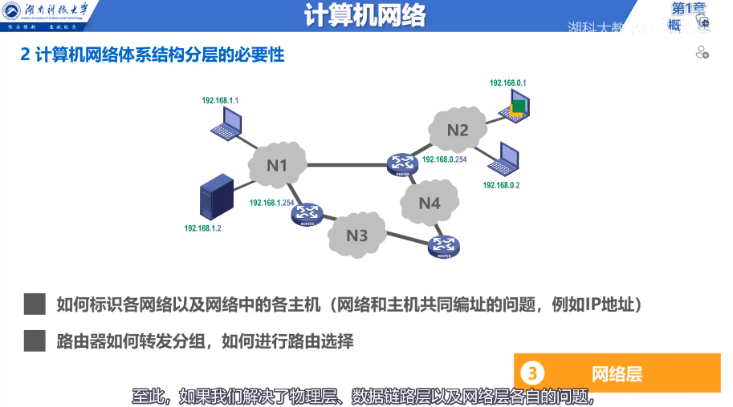
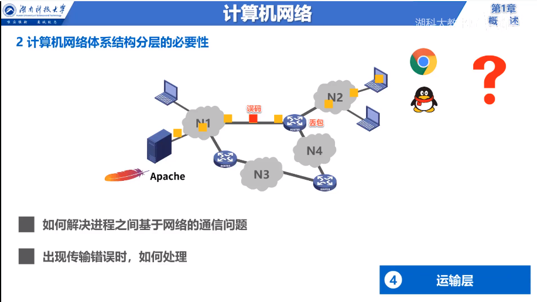
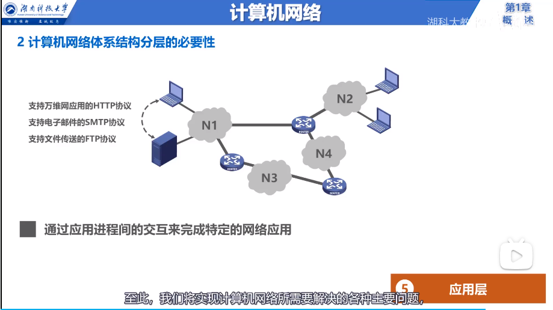
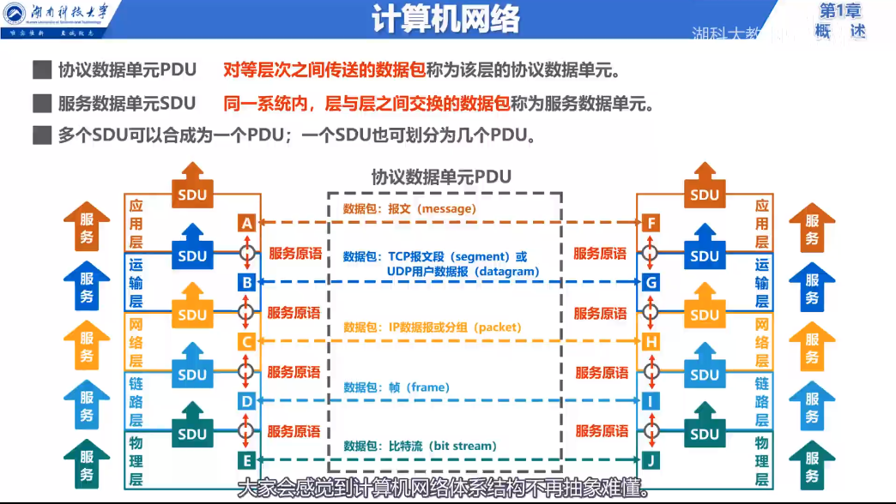

# 计算机网络微课堂

## 因特网概述

### 网络、互联网和因特网

1.  网络(Network)由若干节点和连接这些节点的链路(Link)组成
2.  多个网络还可以通过路由器互联起来，这样就构成了一个覆盖范围更大的网络，即互联网，因此，互联网是网络的网络(Network of Networks)
3.  因特网(Internet)是世界上最大的互联网络（用户数以亿计，互联的网络数以百万计）

### 因特网发展的三阶段

1.  1969, ARPANET 分组交换网出现
2.  70 年代中期，研究多种网络之间的互联
3.  1983, TCP/IP 协议成为 ARPANET 的标准协议（因特网诞生时间）
4.  1985, NSFNET 出现
5.  1990, ARPANET 关闭
6.  1991, 美国政府将因特网主干网交给私人公司经营
7.  1993, NSFNET 被商用因特网主干网替代，政府机构不再负责运营因特网，ISP 负责运营
8.  1994, 万维网技术出现，因特网迅猛的发展
9.  1995, NSFNET 停止运营

### ISP（因特网服务提供者）

中国 ISP: 中国电信、中国联通、中国移动

### 因特网的组成

1.  边缘部分：所有连接在因特网上的主机，这部分是用户直接使用的，用来进行通信和资源共享。
2.  核心部分：由大量网络和连接这些网络的路由器组成，为边缘部分提供服务。

## 三种交换方式

### 电路交换

Def. 电话交换机接通电话线的方式称为电路交换
从通信资源的分配角度来看，交换就是按照某种方式动态地分配传输线路的资源
电路交换的三个步骤：

1.  建立连接（分配通信资源）
2.  通话(一直占用通信资源)
3.  释放连接（归还通信资源）

若使用电路交换传送计算机数据，传输效率往往很低。

_Pro._

1.  通信时延小
2.  有序传输
3.  没有冲突，不同的通信双方的信道不同
4.  适用范围广
5.  实时性强
6.  控制简单

_Con._

1.  建立连接时间长
2.  线路独占，使用效率低
3.  灵活性差
4.  难以规格化

### 报文交换

_Pro._

1.  无需建立连接
2.  动态分配线路
3.  提高线路可靠性
4.  提高线路利用率
5.  提供多目标服务

_Con._

1.  引起了转发时延
2.  需要较大地存储缓存空间
3.  需要传输额外的信息

### 分组交换

发送方：构造分组，发送分组
路由器：缓存分组，转发分组
接收方：接收分组，还原报文

_Pro._

1.  无需建立连接
2.  线路利用率高
3.  简化了存储管理（分组的长度固定）
4.  加速传输
5.  减少出错概率和重发数据量（即便出错，只需要重传一个分组）

_Con._

1.  引起了转发时延
2.  需要传输额外的信息量
3.  对于数据报服务，存在失序、丢失或重复分组

## 计算机网络的定义和分类

### 定义

一个定义：一些**互相连接**的、**自治**的计算机的**集合**
互连：计算机之间可以通过有线或无线方式进行数据通信
自治：独立的计算机，它有自己的硬件和软件，可以单独运行使用
集合：至少需要两台计算机

另一个定义：计算机网络主要是由一些通用的、可编程的硬件互连而成的，而这些硬件并非专门用来实现某一特定目地。这些可编程的硬件能够用来传送不同类型的数据，并能支持广泛的和日益增长的应用。

### 分类

按覆盖范围分类：

- 广域网：WAN
- 城域网：MAN
- 局域网：LAN
- 个域网：PAN

## 计算机网络中的性能指标

### 速率

1 Byte = 8 bit
KB = $2^{10}$ B
MB = K\*KB = $2^{20}$ B
GB = K\*MB
TB = K\*GB

bit/s(b/s, bps)
kb/s = $10^{3} b/s$ (bps)
Mb/s = k\*kb/s = $10^{6} b/s$ (bps)
Gb/s = k\*Mb/s = $10^{9} b/s$ (bps)
Tb/s = k\*Gb/s = $10^{12} b/s$ (bps)

### 带宽

带宽用于表示网络的通信线路所能传送数据的能力，因此网络带宽表示在单位时间内从网络中的某一点到另一点所能通过的“最高数据率”。

### 吞吐量

表示在单位时间内通过某个网络（或信道、接口）的数据量。

### 时延

发送时延 = 分组长度/发送速率
传播时延 = 信道长度/电磁波的传播速率
处理时延，不方便计算

### 时延带宽积

时延带宽积 = 传播时延 \* 带宽

### 往返时间

RTT（往返时间，Round-Trip Time），通信双方交互一次所用的时间

### 利用率

1.  信道利用率：某信道有百分之几的时间是被利用的
2.  网络利用率：全网络的信道利用率的加权平均

### 丢包率

分组丢失率，是指在一定的时间范围内，传输过程中丢失的分组数量与总分组数量的比率。

## 计算机网络体系结构

### 常见计算机网络体系结构

OSI 体系结构：物理层、数据链路层、网络层、运输层、会话层、表示层、应用层
TCP/IP 结构：网络接口层、网际层、运输层、应用层
原理体系结构：物理层、数据链路层、网络层、运输层、应用层

### 分层的必要性

### 计算机网络体系结构中的专用术语

- 实体：任何可发送或接收信息的硬件或软件进程
- 对等实体：收发双方相同层次的实体
- 协议：控制两个对等实体进行逻辑通信的规则的集合
  三要素：
  1.  语法：定义所交换信息的格式
  2.  语义：定义收发双方所要完成的操作
  3.  同步：定义收发双方的时序关系
- 服务：在协议的控制下，两个对等实体间的逻辑通信使得本层能够向上一层提供服务
  要实现本层协议，还需要使用下面一层所提供的服务
  协议是水平的，服务是垂直的
- 服务访问点：在同一系统中，相邻两层的实体交换信息的逻辑接口，用于区分不同的数据类型
  - 数据链路层的服务访问点为帧的“类型”字段
  - 网络层的服务访问点为 IP 数据包首部中的“协议”字段
  - 运输层的服务访问点为“端口号”
- 服务原语：上层使用下层所提供的服务必须通过与下层交换一些命令，这些命令称为服务原语
- 协议数据单元 PDU：对等层次之间传送的数据包称为该层的协议数据单元
  服务数据单元 SDU：同一系统内，层与层之间交换的数据包称为服务数据单元
  多个 SDU 可以合成为一个 PDU, 一个 SDU 也可以划分为几个 PDU。

  

## 物理层概述

### 物理层要实现的功能

它要做的是“透明的”在各种传输媒体上传输 0 和 1。
“透明”：数据链路层看不见（也无需看见）物理层究竟是用的是什么方法来传输比特流。只需要享受物理层提供的比特流传输服务即可。

### 物理层接口特性

机械特性：形状和尺寸，引脚数目和排列，固定和锁定装置
电气特性：信号电压的范围，阻抗匹配的情况，传输速率，距离限制
功能特性：规定接口电缆的各条信号线的作用
过程特性：规定在信号线上传输比特流的一组操作过程，包括各信号间的时序关系

## 物理层下面的传输媒体
