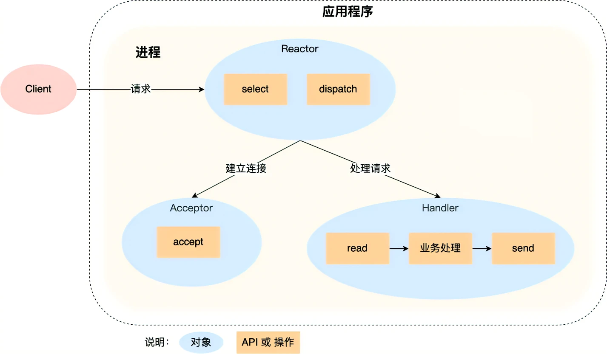
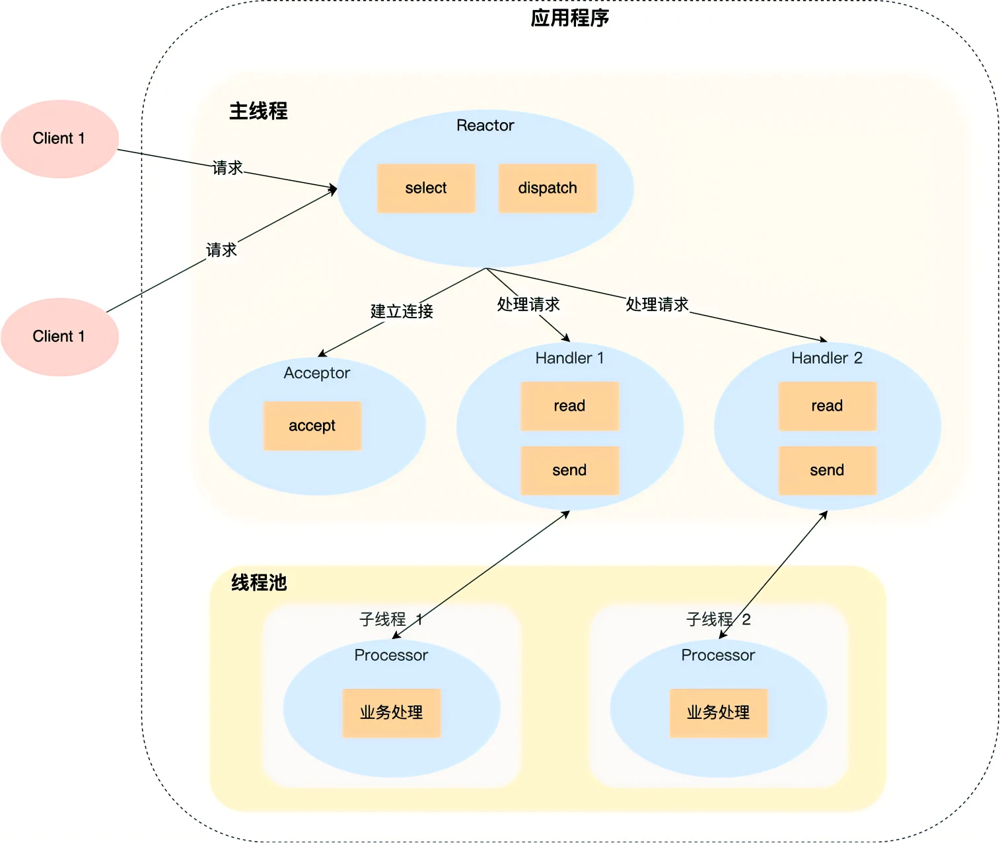
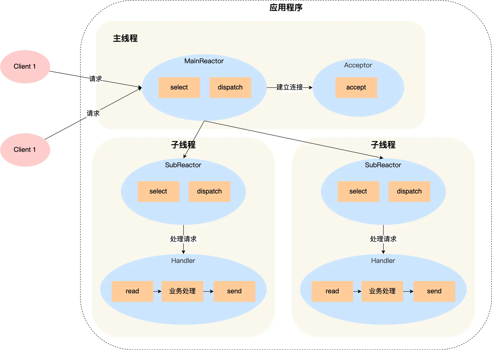

# 高性能网络模式: Reactor 和 Proactor

多线程的问题：线程的创建和销毁，不仅会带来性能开销，也会浪费资源

线程池的问题：线程在处理某个连接的 `read` 操作时，如果遇到没有数据可读，就会发生阻塞，那么线程就无法继续处理其他连接的业务，即使将 socket 改为非阻塞，线程还是需要不断的轮询调用 `read` 操作判断数据是否准备完毕，随着线程处理的连接的增多，效率会很低

所以，我们要想办法只有当连接上有数据的时候，线程才发起读请求，即使用 I/O 多路复用

## Reactor

编程 I/O 多路复用时，使用的是 面向过程 的方式，于是有些人对其进行了封装，开发者不需考虑底层网络 API 的细节，而只关注应用代码的编写，即 Reactor 模式。

### 单 Reactor 单进程/线程

- Reactor 的作用是监听和分发事件
- Acceptor 的作用是获取连接
- Handler 的作用是处理业务

1. Reactor 通过 select(poll or epoll) 监听事件，收到事件后通过 dispatch 进行分发
2. 如果是连接建立事件，则交给 Acceptor 进行处理，使用 accept 分发获取连接，并创建一个 Handler 处理后续响应事件
3. 如果不是连接建立事件，则交由当前连接对应的 Handler 对象来进行响应
4. Handler 通过 read->业务处理->send 的流程完成完整的业务流程

缺点：

1. 未能充分利用多核 CPU 的性能
2. Handler 对象处理业务时，处于阻塞状态，无法处理其他连接事件

### 单 Reactor 多进程/线程

1. 与单进程/线程不同的是，Handler 对象不再负责业务处理，而是只负责数据的接收和发送，通过 read 读取到数据后，交给子线程中的 Processor 对象进行业务处理
2. 子线程的 Processor 对象处理完成之后，将结果发送给 Handler 对象，接着由 Handler 通过 send 分发将响应结果发送给 client
3. 一个 Reactor 对象承担所有事件的监听和响应的情况下，在面对瞬间高并发的场景时，很容易成为性能瓶颈的地方

### 多 Reactor 多进程/线程

1. 主进程的 MainReactor 通过 select 监控连接建立事件，收到事件后通过 Acceptor 中的 accept 获取连接，将新的连接分配给某个子线程
2. 子线程中的 SubReactor 将 MainReactor 分配的连接加入 select 继续监听，并创建一个 Handler 用于处理连接的响应事件
3. 新的事件发生时，SubReactor 会调用当前连接对应的 Handler 对象进行响应
4. Handler 对象通过 read->业务处理->send 的流程完成完整的业务流程

主线程和子线程分工十分明确，主线程只负责接收新连接，子线程负责完成后续的业务处理，主线程和子线程的交互也很简单，主线程只需要把新连接传给子线程，子线程无需返回数据，直接就可以在子线程将处理结果发送给客户端。

## Proactor

Reactor 是非阻塞同步网络模式，而 Proactor 是异步网络模式。

异步 I/O 在内核数据准备阶段和内核空间到用户空间的拷贝阶段都无需等待。

- Reactor 是非阻塞同步网络模式，感知的是**可读写事件的就绪**，在每次感知到有事件发生后，就需要应用进程主动调用 read 方法来完成数据的读取，也就是要应用进程主动将 socket 接收缓存中的数据读到应用进程中，这个过程是同步的，读取完成数据后应用进程才能处理数据
- Proactor 是异步网络模式，感知的是**已完成的读写事件**。在发起异步读写请求时，需要传入数据缓冲区的地址等信息，这样系统内核才可以自动完成数据的读写工作，操作系统完成读写完成任务之后，就会通知应用进程直接处理数据
  
无论是 Reactor，还是 Proactor，都是一种基于「事件分发」的网络编程模式，区别在于 Reactor 模式是基于「待完成」的 I/O 事件，而 Proactor 模式则是基于「已完成」的 I/O 事件。
