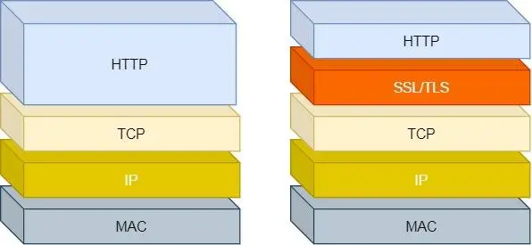

# HTTP 常见面试题

## 基本概念

HTTP 是超文本传输协议，全称 HyperText Transfer Protocol.

## 常见状态码

- 1xx: 提示信息，表示目前是协议处理的中间状态，还需要后续操作
- 2xx: 成功，报文已经收到并正确处理
- 3xx: 重定向，资源位置发生变动，需要客户端重新发送请求
- 4xx: 客户端错误，请求报文有误，服务器无法处理
- 5xx: 服务端错误，服务器在处理请求时内部发生了错误

## HTTP 缓存技术

### HTTP 缓存实现方式

强制缓存和协商缓存。

## HTTPS

Https 在 http 与 TCP 层之间加入了 SSL/TLS 协议。

公钥加密，私钥解密。这个目的是为了保证内容传输的安全，因为被公钥加密的内容，其他人是无法解密的，只有持有私钥的人，才能解密出实际的内容；

私钥加密，公钥解密。这个目的是为了保证消息不会被冒充，因为私钥是不可泄露的，如果公钥能正常解密出私钥加密的内容，就能证明这个消息是来源于持有私钥身份的人发送的。
