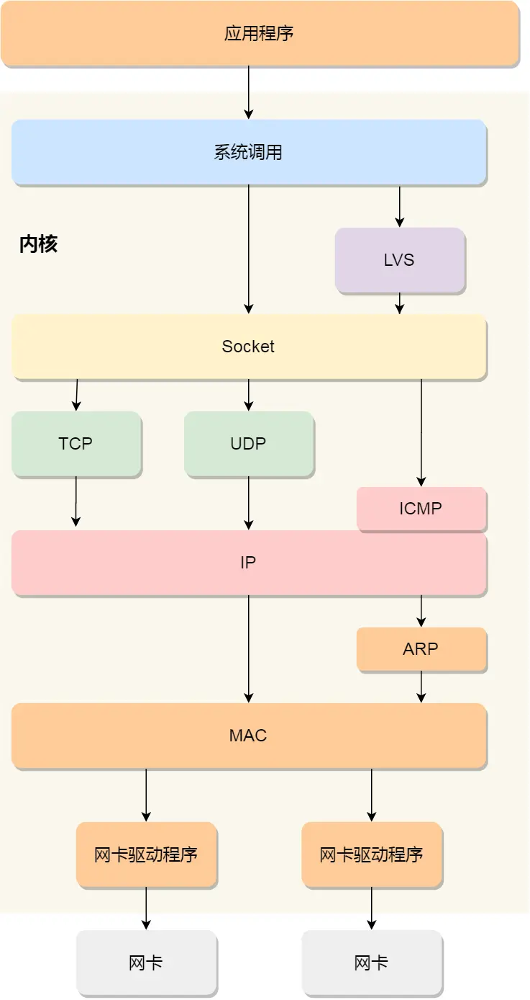

# Linux 系统如何收发网络包

Linux 系统是按照 TCP/IP 四层网络模型实现网络协议栈的。

- 应用层：负责向用户提供一组应用程序，比如 HTTP，DNS，FTP 等
- 传输层：负责端到端的通信，比如 TCP、UDP 等
- 网络层：负责网络包的封装、分片、路由、转发，比如 IP、ICMP 等
- 网络接口层：负责网络包在物理网络中的传输，比如网络包的封帧、MAC 寻址、差错检，以及通过网卡传输网络帧等

Linux 网络协议栈：

> <https://xiaolincoding.com/network/1_base/how_os_deal_network_package.html#linux-%E5%8F%91%E9%80%81%E7%BD%91%E7%BB%9C%E5%8C%85%E7%9A%84%E6%B5%81%E7%A8%8B>
