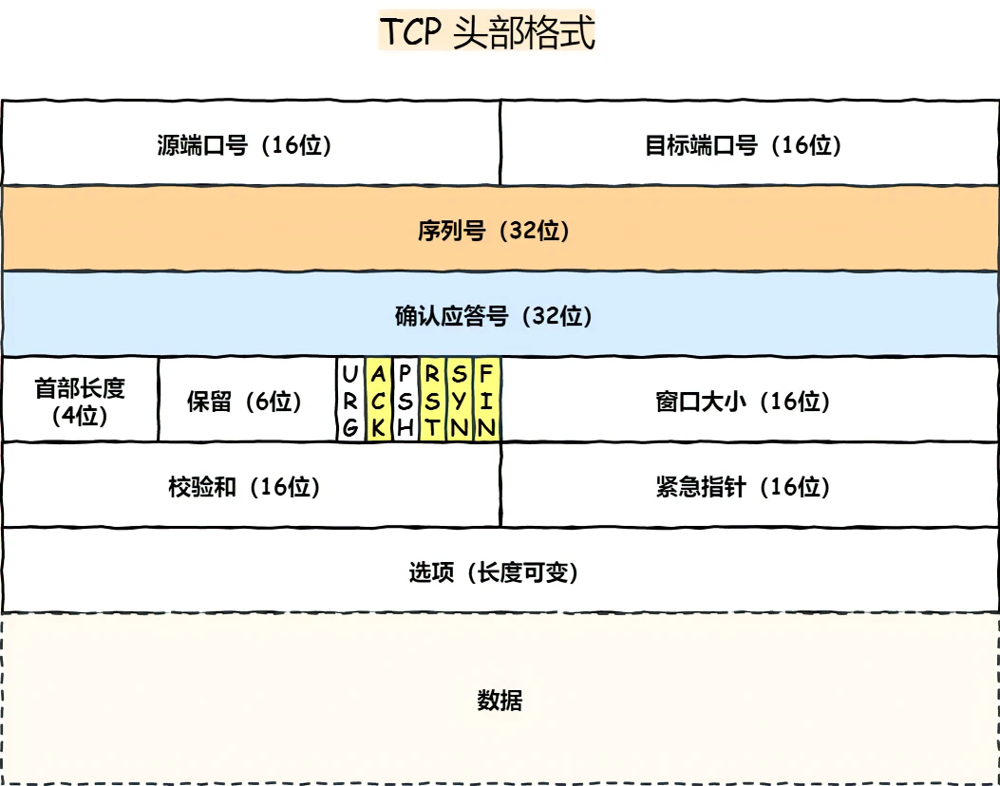
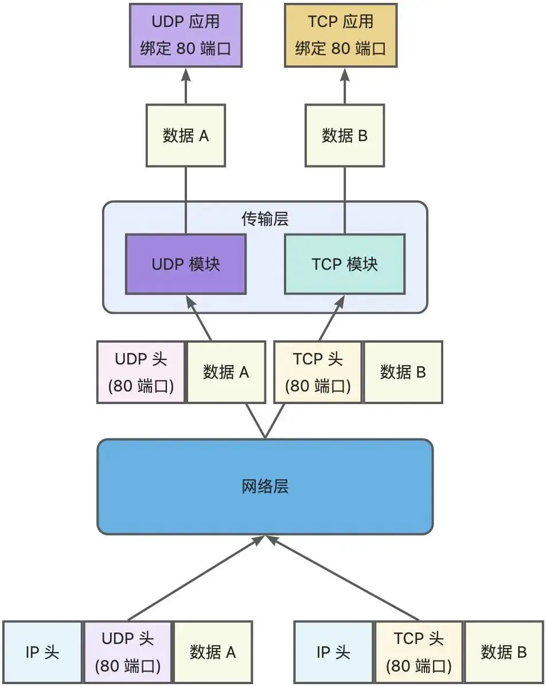
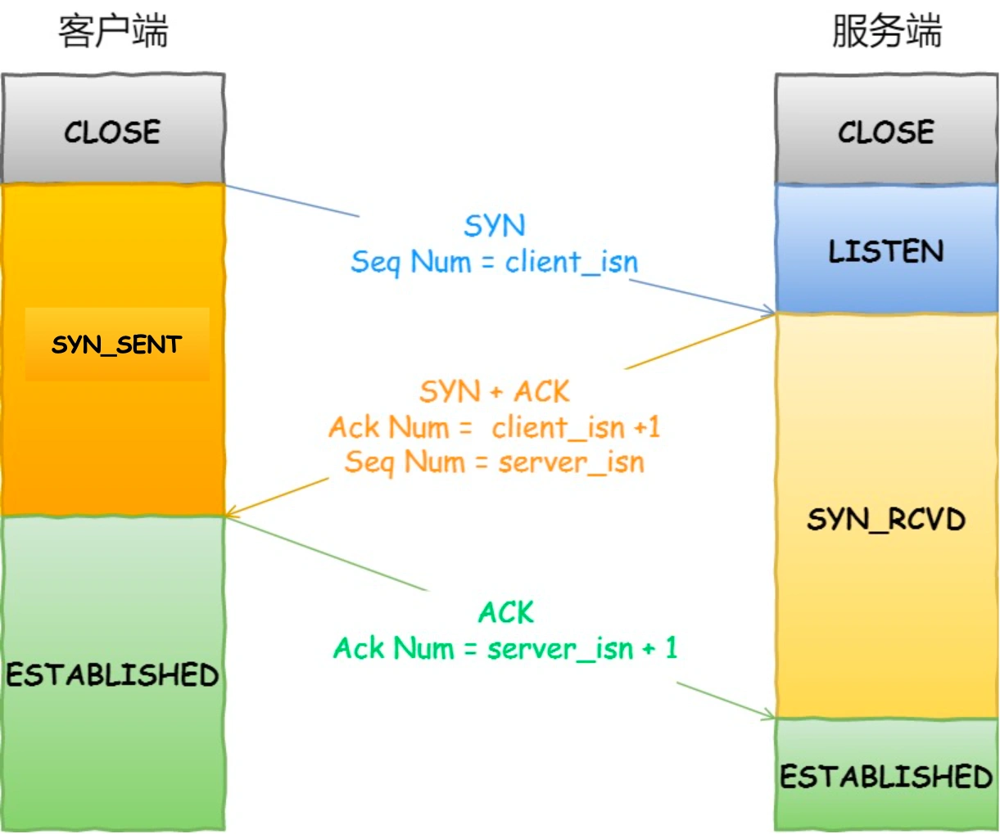
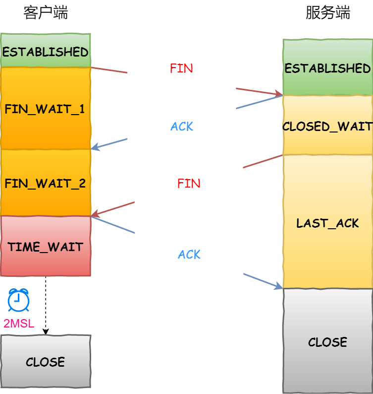

# TCP 三次握手与四次挥手

TCP 头部格式：

序列号：在建立连接时，计算机生成随机数作为初始值，通过 SYN 包发送给接收端，每发送一次数据，就累加一次，**以解决网络包乱序问题**。

确认应答号：指下一次期望收到的数据的序列号，发送端收到这个确认应答以后可以认为在这个序号以前的数据都已经被正常接收，**以解决丢包的问题**。

控制位：

- ACK：该位为 1 时，「确认应答」的字段变为有效，TCP 规定除了最初建立连接时的 SYN 包之外该位必须设置为 1 。
- RST：该位为 1 时，表示 TCP 连接中出现异常必须强制断开连接。
- SYN：该位为 1 时，表示希望建立连接，并在其「序列号」的字段进行序列号初始值的设定。
- FIN：该位为 1 时，表示今后不会再有数据发送，希望断开连接。当通信结束希望断开连接时，通信双方的主机之间就可以相互交换 FIN 位为 1 的 TCP 段。

## 为什么需要 TCP 协议，TCP 工作在哪一层

网络层是不可靠的，不保证网络包的交付，不保证网络包的按序交付，也不保证网络包中的数据完整性。

如果需要保障网络数据包的可靠性，那么就需要由上层（传输层）的 TCP 协议来负责。

因为 TCP 是一个工作在传输层的可靠数据传输的服务，它能确保接收端接收的网络包是无损坏、无间隔、非冗余和按序的。

## 什么是 TCP

TCP 是面向连接的，可靠的，基于字节流的传输层通信协议。

通过 源地址、源端口、目标地址、目标端口 四元组可以唯一确定一个连接。

源地址和目的地址的字段在 IP 头部中，作用是通过 IP 协议发送报文给对方主机，源端口和目标端口的字段在 TCP 头部中，作用是告诉 TCP 协议应该把报文发给哪个进程。

## 并发数量限制

1. 文件描述符限制，每个 TCP 连接都是一个文件，如果文件描述符被占满了，会发生 Too many open files.
2. 内存限制，每个 TCP 连接都要占用一定内存，操作系统的内存是有限的，如果内存资源被占满后，会发生 OOM.

## TCP And UDP

## TCP 三次握手

## 为什么需要三次握手

TCP 使用三次握手建立连接的最主要原因就是防止「历史连接」初始化了连接。

## TCP 四次挥手

