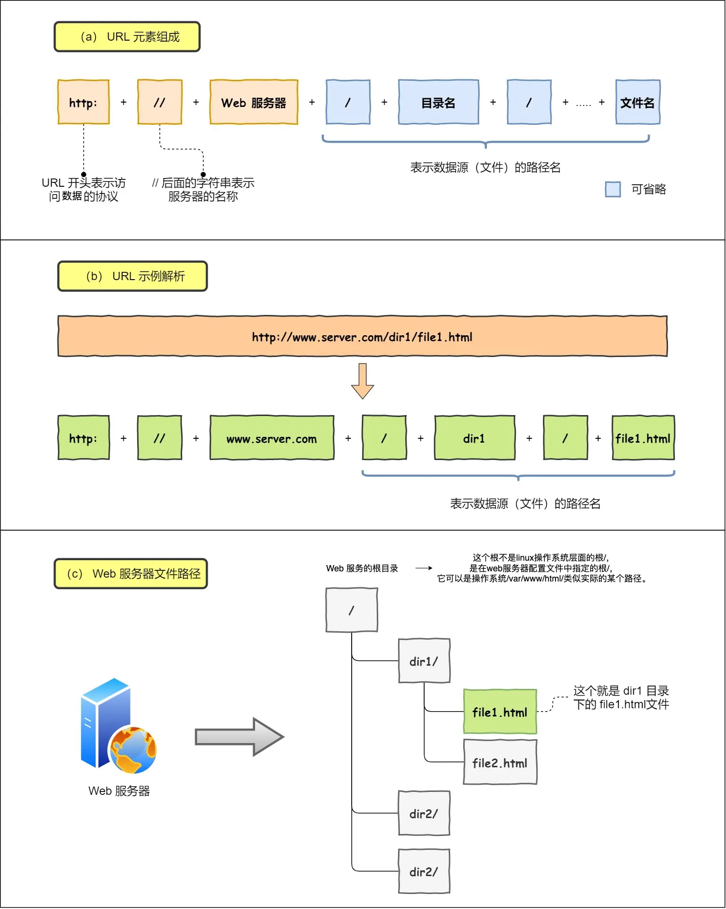

# 键入网址到网页显示，期间发生了什么

## 应用层--HTTP协议

浏览器对 URL 进行解析，生成发送给 Web 服务器的请求信息。

`http://web server/目录/../文件名`

URL 解析成功后，浏览器会根据这些信息生成 HTTP 报文。

### 请求报文

1. 请求行：方法 URL 版本，如 GET / HTTP/1.1
2. 请求头：首部字段名: 字段值 ...，如 ACCECPT: \*/\*
3. 请求体：具体数据

### 响应报文

1. 响应行：版本 状态码 短语，如 HTTP/1.1 200 OK
2. 响应头：首部字段名: 字段值 ...，如 Content-Type: text/html
3. 响应体：具体数据

## 应用层--DNS 解析
