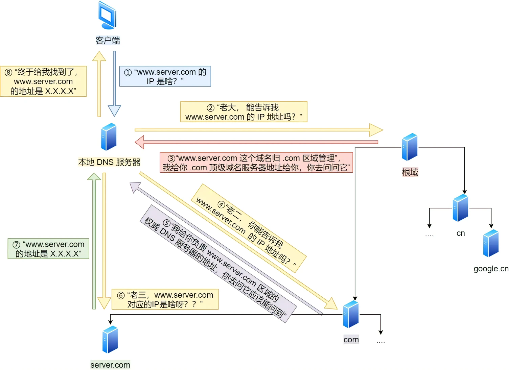
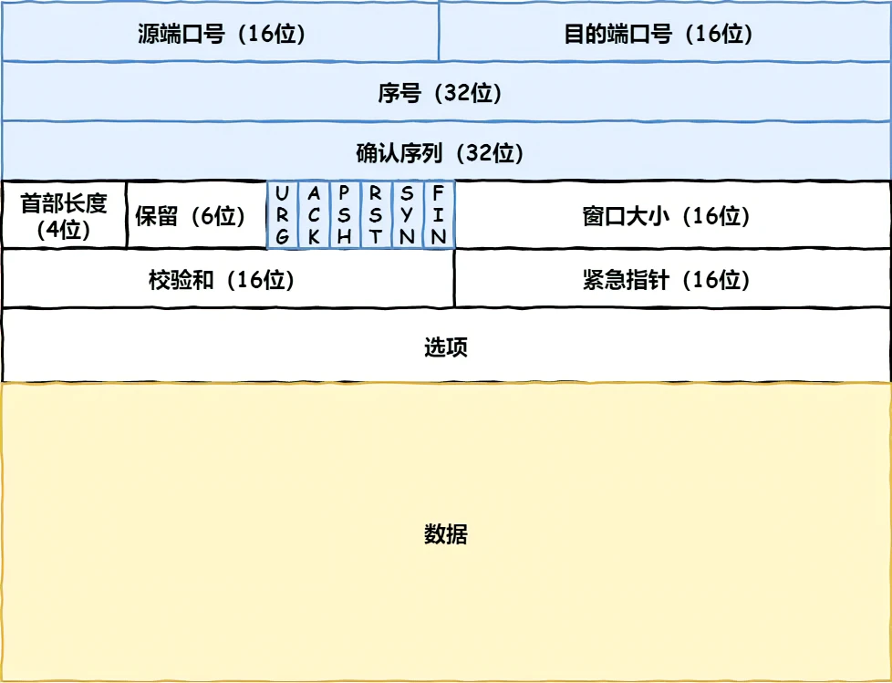
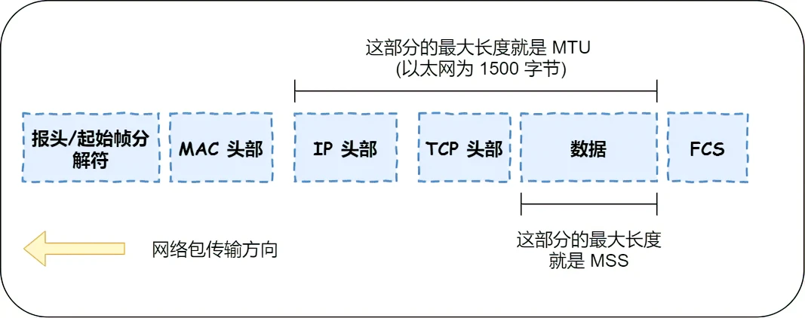
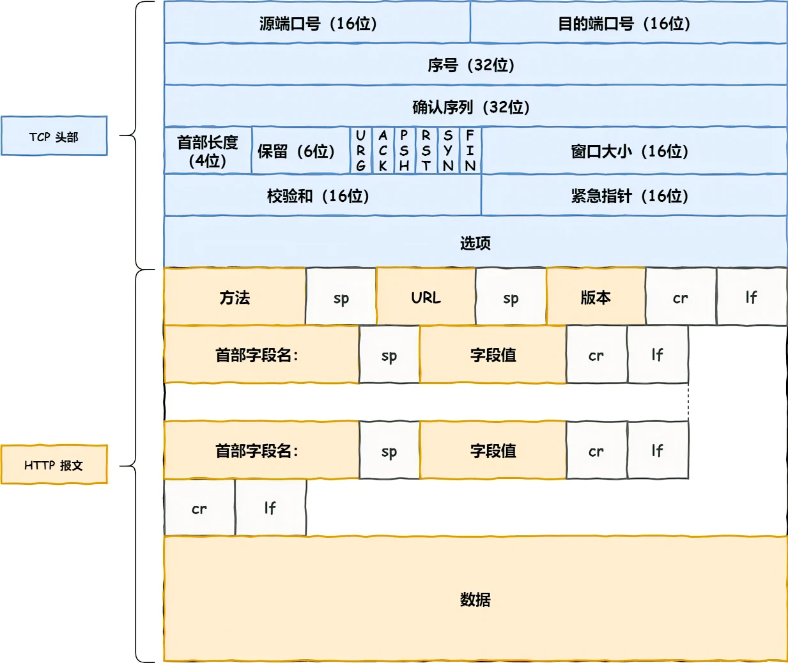
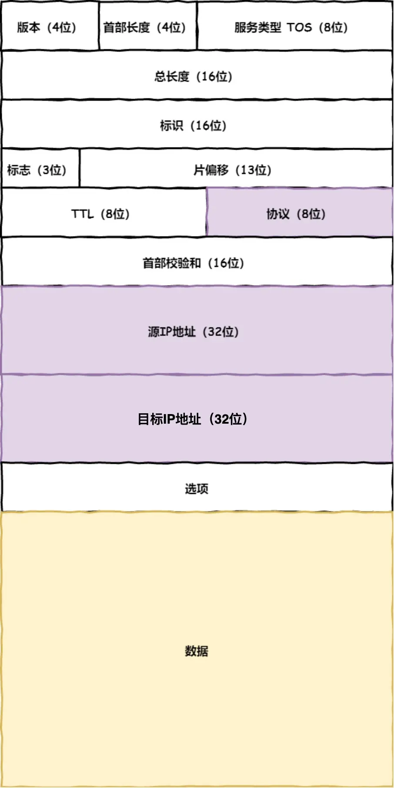
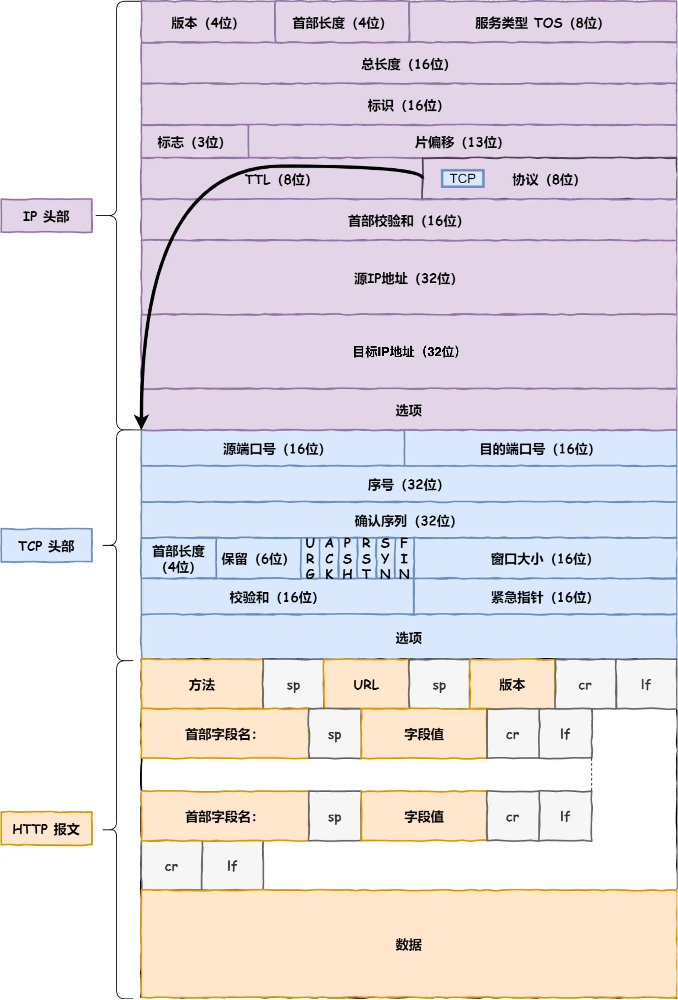
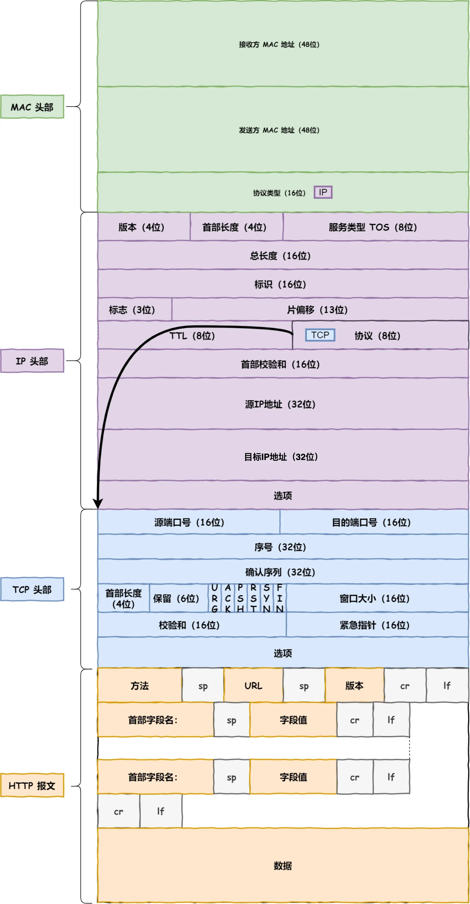
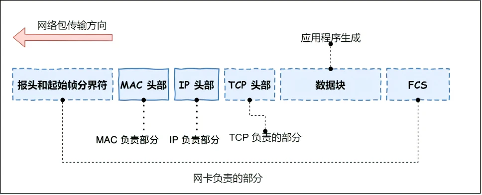
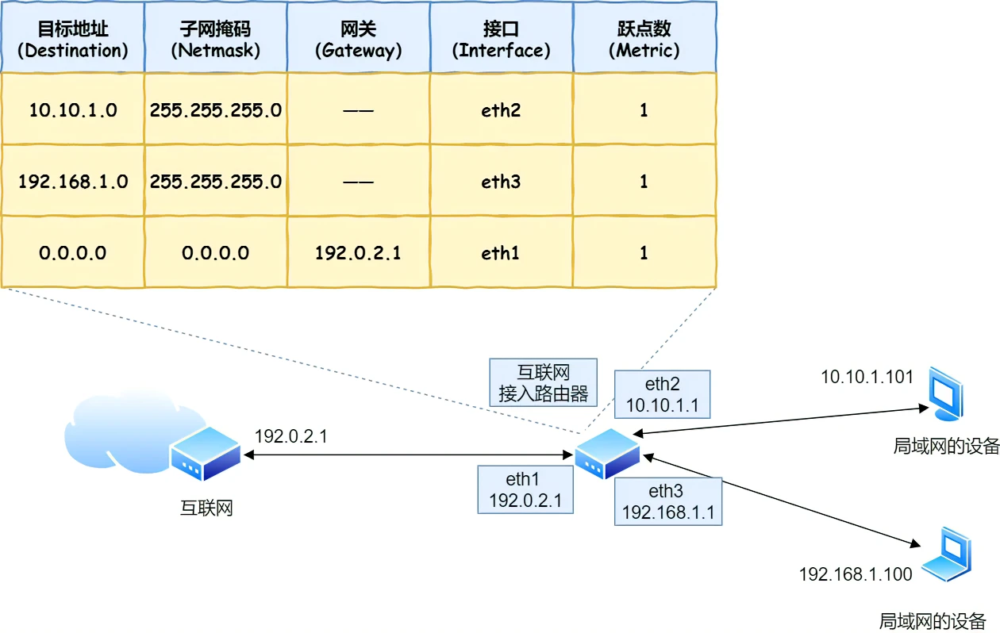

# 键入网址到网页显示，期间发生了什么

## 应用层--HTTP协议

浏览器对 URL 进行解析，生成发送给 Web 服务器的请求信息。

`http://web server/目录/../文件名`

URL 解析成功后，浏览器会根据这些信息生成 HTTP 报文。

### 请求报文

1. 请求行：方法 URL 版本，如 GET / HTTP/1.1
2. 请求头：首部字段名: 字段值 ...，如 ACCECPT: \*/\*
3. 请求体：具体数据

### 响应报文

1. 响应行：版本 状态码 短语，如 HTTP/1.1 200 OK
2. 响应头：首部字段名: 字段值 ...，如 Content-Type: text/html
3. 响应体：具体数据

## 应用层--DNS 解析

委托操作系统发送消息时，必须提供通信对象的 IP 地址。

### 域名的层级关系

DNS 中的域名使用句点分隔，比如 `www.server.com`，这里的句点代表了不同层次之间的界限，越靠右，层级越高。

### 域名解析的工作流程

根域名--二级域名--三级域名--etc

不是每一次都需要经过这个完整的流程，毕竟我们还有缓存。

## 传输层--TCP

TCP 报文格式：

1. 源端口号和目的端口号：确定发送给哪个应用
2. 序号：解决包乱序的问题
3. 状态位：SYN 用于发起连接，ACK 用于回复，RST 重新连接，FIN 结束连接
4. 窗口大小：用于流量控制

### TCP 分割数据

一旦 HTTP 数据包长度大于 MSS，TCO 就把 HTTP 的数据拆解成一块块的数据发送。

至此，网络包的报文如下图。

## 网络层--IP

TCP模块在执行连接、收发、断开等各阶段操作时，都需要委托 IP 模块将数据封装成网络包发送给通信对象。

IP 报文格式：

源 IP 地址表示客户端输出的 IP 地址，目标 IP 地址表示通过 DNS 域名解析获得的 Web 服务器 IP 地址。

至此，网络包的报文如下图：

## 链路层--Mac

ARP 协议会在以太网中以广播的形式，对以太网所有的设备喊出：“这个 IP 地址是谁的？请把你的 MAC 地址告诉我”。

然后就会有人回答：“这个 IP 地址是我的，我的 MAC 地址是 XXXX”。

如果对方和自己处于同一个子网中，那么通过上面的操作就可以得到对方的 MAC 地址。然后，我们将这个 MAC 地址写入 MAC 头部，MAC 头部就完成了。

当然，我们也没必要每次都广播，毕竟我们还有缓存。

使用 `arp -a` 可以获得 arp 的缓存数据。

至此，网络包的报文是：

### 链路层--网卡

网络包只是存放在内存中的一串二进制数字信息，没有办法直接发送给对方。因此，我们需要将数字信息转换为电信号，才能在网线上传输，也就是说，这才是真正的数据发送过程。

负责执行这一操作的是网卡，要控制网卡还需要靠网卡驱动程序。

网卡驱动获取网络包之后，会将其复制到网卡内的缓存区中，接着会在其开头加上报头和起始帧分界符，在末尾加上用于检测错误的帧校验序列。

- 起始帧分界符是一个用来表示包起始位置的标记
- 末尾的 FCS（帧校验序列）是用来检查包传输过程是否有损坏

最后网卡会将包转化为电信号，通过网线发送数据。

### 链路层--交换机

交换机没有 Mac 地址，存了一张 Mac 地址表，根据传入的目标 Mac 地址，找到出口端口，以转发到路由器或者目标主机。

## 路由器

经过交换机，就来到了路由器。

### 包接收

首先，电信号到达网线接口部分，路由器中的模块会将电信号转成数字信号，然后通过包末尾的 FCS 进行错误校验。

如果没问题则检查 MAC 头部中的接收方 MAC 地址，看看是不是发给自己的包，如果是就放到接收缓冲区中，否则就丢弃这个包。

总的来说，路由器的端口都具有 MAC 地址，只接收与自身地址匹配的包，遇到不匹配的包则直接丢弃。

### 确定输出端口

完成包接收操作之后，路由器就会去掉包开头的 MAC 头部。

MAC 头部的作用就是将包送达路由器，其中的接收方 MAC 地址就是路由器端口的 MAC 地址。因此，当包到达路由器之后，MAC 头部的任务就完成了，于是 MAC 头部就会被丢弃。

接下来，路由器会根据 MAC 头部后方的 IP 头部中的内容进行包的转发操作。

转发操作分为几个阶段，首先是查询路由表判断转发目标。

具体的工作流程根据上图，举个例子。

假设地址为 10.10.1.101 的计算机要向地址为 192.168.1.100 的服务器发送一个包，这个包先到达图中的路由器。

判断转发目标的第一步，就是根据包的接收方 IP 地址查询路由表中的目标地址栏，以找到相匹配的记录。

路由匹配和前面讲的一样，每个条目的子网掩码和 192.168.1.100 IP 做 & 与运算后，得到的结果与对应条目的目标地址进行匹配，如果匹配就会作为候选转发目标，如果不匹配就继续与下个条目进行路由匹配。

如第二条目的子网掩码 255.255.255.0 与 192.168.1.100 IP 做 & 与运算后，得到结果是 192.168.1.0 ，这与第二条目的目标地址 192.168.1.0 匹配，该第二条目记录就会被作为转发目标。

实在找不到匹配路由时，就会选择默认路由，路由表中子网掩码为 0.0.0.0 的记录表示「默认路由」。

### 包发送

接下来就会进入包的发送操作。

首先，我们需要根据路由表的网关列判断对方的地址。

- 如果网关是一个 IP 地址，则这个IP 地址就是我们要转发到的目标地址，还未抵达终点，还需继续需要路由器转发。
- 如果网关为空，则 IP 头部中的接收方 IP 地址就是要转发到的目标地址，也是就终于找到 IP 包头里的目标地址了，说明已抵达终点。

知道对方的 IP 地址之后，接下来需要通过 ARP 协议根据 IP 地址查询 MAC 地址，并将查询的结果作为接收方 MAC 地址。

路由器也有 ARP 缓存，因此首先会在 ARP 缓存中查询，如果找不到则发送 ARP 查询请求。

接下来是发送方 MAC 地址字段，这里填写输出端口的 MAC 地址。还有一个以太类型字段，填写 0800 （十六进制）表示 IP 协议。

网络包完成后，接下来会将其转换成电信号并通过端口发送出去。这一步的工作过程和计算机也是相同的。

发送出去的网络包会通过交换机到达下一个路由器。由于接收方 MAC 地址就是下一个路由器的地址，所以交换机会根据这一地址将包传输到下一个路由器。

接下来，下一个路由器会将包转发给再下一个路由器，经过层层转发之后，网络包就到达了最终的目的地。

不知你发现了没有，在网络包传输的过程中，源 IP 和目标 IP 始终是不会变的，一直变化的是 MAC 地址，因为需要 MAC 地址在以太网内进行两个设备之间的包传输。

## 其他

现在的路由器其实已经具备了交换机的功能。

在发送数据包时，如果目标主机不是本地局域网，填入的 MAC 地址是路由器，也就是把数据包转发给路由器，路由器一直转发下一个路由器，直到转发到目标主机的路由器，发现 IP 地址是自己局域网内的主机，就会 arp 请求获取目标主机的 MAC 地址，从而转发到这个服务器主机。
