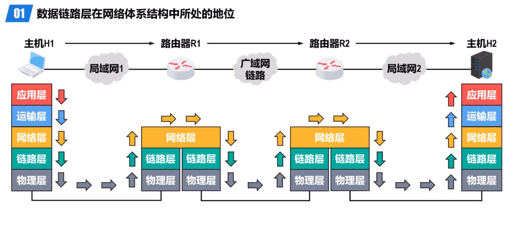
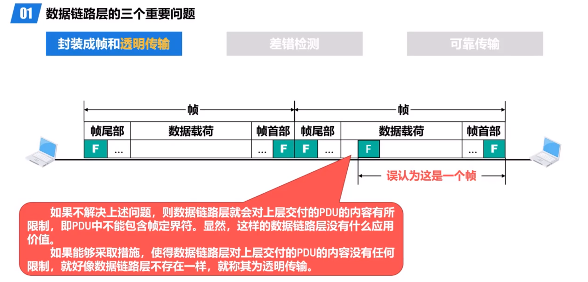
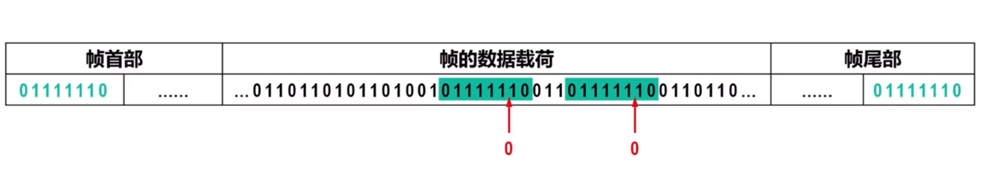
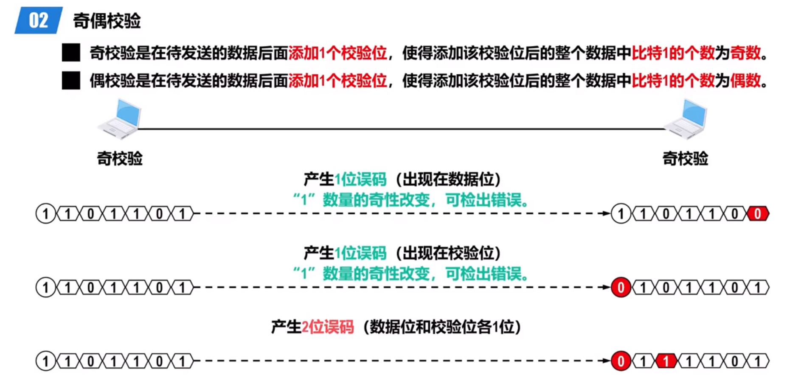
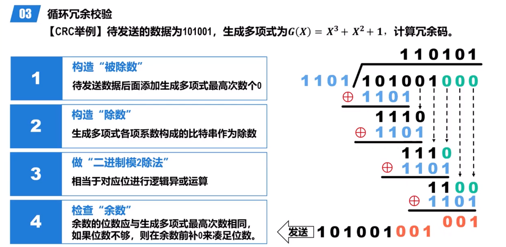
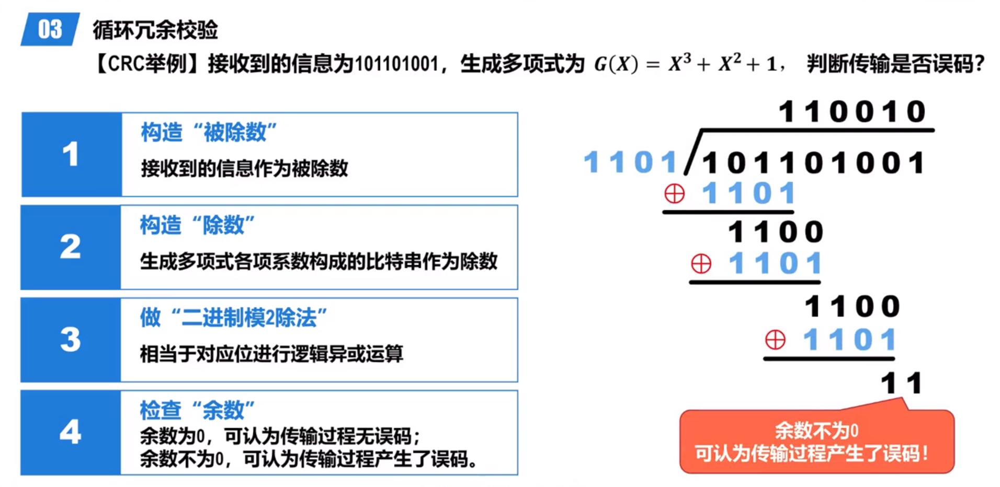
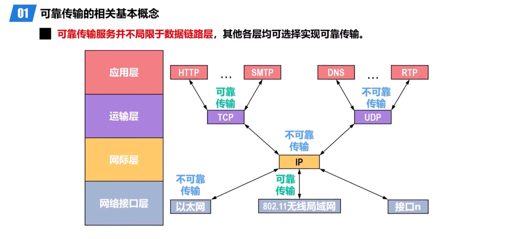

# 数据链路层概述

**链路：是指从一个节点到相邻节点的一段物理线路（有线或无线），而中间没有任何其他的交换节点。**

**数据链路：基于链路，当在一条链路上传送数据时，除需要链路本身，还需要一些必要的通信协议来控制这些数据的传输，把实现这些协议的硬件和软件加到链路上，就构成了通信链路。**

**计算机中的网络适配器（网卡）和其相应的软件驱动程序就实现了这些协议。一般的网络适配器都包含了物理层和数据链路层这两层的功能。**

**帧（Frame）是数据链路层对等实体之间在水平方向进行逻辑通信的协议数据单元PDU.**

## 数据链路层的三个重要问题

### 封装成帧和透明传输

a. 封装成帧表示数据链路层给上层交付下来的协议数据单元 PDU 添加一个尾部一个首部，使之成为帧。

b. 帧首部和尾部的作用之一就是**帧定界**（不是每一种协议都有帧定界符，可以使用帧间间隔）。

c. 为了提高数据链路层传输帧的效率，应当使帧的数据载荷的长度尽可能大于帧首部和尾部的长度。

d. 考虑到对缓存空间的需求以及差错控制等诸多因素，每一种数据链路层协议都规定了帧的数据载荷的长度上限，即最大传送单元（Maximum Transfer Unit, MTU）。例如，以太网的 MTU 为 1500 个字节。

a. 透明传输是指数据链路层对上层交付下来的协议数据单元 PDU 没有任何限制，就好像数据链路层不存在一样。

b. 面向字节的物理链路使用字节填充的方式实现透明传输，假如数据载荷中存在帧定界符，那么可以添加转义符（1字节）

c. 面向比特的物理链路使用比特填充的方式实现透明传输，假如数据载荷中存在帧定界比特流，那么可以在连续的 5 个 1 后添加一个 0（因为帧首部和尾部都是连续 6 个 1）。

HDLC 协议：使用 `01111110` 作为帧首部和尾部定界符。

### 差错检测

使用差错检测技术来检测数据在传输过程中是否产生了比特差错，是数据链路层所要解决的重要问题之一。

FCS 字段：存放检错码。

_帧检验序列_ 检测传输中是否出现误码。

**奇偶校验：**

在所传输的数据中，如果有奇数个位发生误码，则所包含比特1的数量的奇偶性会发生改变，可以检测出误码，但如果有偶数个位发生误码，则所包含比特1的数量的奇偶性不会发生改变，无法检测出误码。

在实际使用中，奇偶校验又可分为垂直奇偶校验，水平奇偶校验以及水平垂直奇偶校验。

**循环冗余校验：**

数据链路层广泛使用漏检率极低的循环冗余校验（Cyclic Redundancy Check, CRC）检错技术。

- 收发双方约定好一个生成多项式G(x)
- 发送方基于待发送的数据和生成多项式G(x)，计算出差错检测码（冗余码），将冗余码添加到待发送数据的后面一起传输
- 接收方收到数据和冗余码后，通过生成多项式G(x)来计算收到的数据和冗余码对比，即可判断是否产生了误码

不论是奇偶校验或循环冗余校验，只能检测出传输过程中出现了差错，但并不能定位错误，甚至纠错。

计算机网络中，通常采用后续课程中将要介绍的检错重传方式来纠正传输中的差错，或者仅仅丢弃检测到差错的帧，这取决于数据链路层向其上层提供的是可靠传输服务还是不可靠传输服务。

### 可靠传输

#### 可靠传输的相关基本概念

1. 使用差错检测技术，接收方的数据链路层可以检测出帧在传输过程中是否产生了误码（比特差错）
2. 取决于数据链路层向其上层提供的服务类型
   1. 不可靠传输服务（UDP）：丢弃有误码的帧
   2. 可靠传输服务：提供某种机制实现发送方发送什么，接收方最终就能收到什么
3. 一般情况下，有线链路的误码率比较低，为了减小开销，并不要求数据链路层向其上层提供可靠传输服务，即使出现了误码，可靠传输的问题由其上层处理
4. 而无线链路易受干扰，误码率比较高，因此要求数据链路层必须向其上层提供可靠传输服务

传输差错：

- 误码（比特差错）
- 分组丢失
- 分组失序
- 分组重复

可靠传输服务并不局限于数据链路层，其他各层均可选择实现可靠传输。

